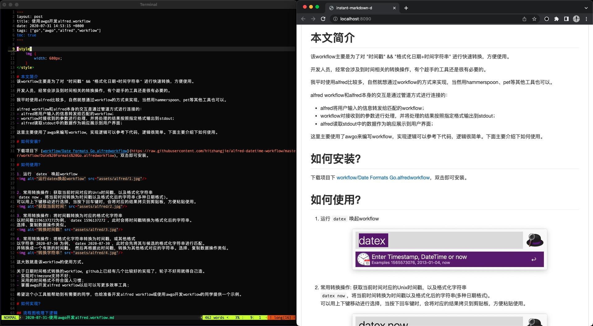

# Linux桌面发行版分享

这是一篇写在2016年的文章一直在我的个人笔记里，感觉当时很多想法今天依然成立，所以拿出来继续分享下。某些信息可能已经有过时，相关的部分我在备注里进行了标注，

## 0.体验Linux发行版

今天安装了Ubuntu 16.04 LTS，本来准备一直用Fedora的，但是我的笔记本上安装的还是
Fedora 21版本，但是当前最新的已经更新到了Fedora 24,今天刚刚发布了Beta版本。此
前我对Fedora 23 GA以及Fedora 24 Alpha版本进行了简单的测试，实在是不喜欢KDE 5！  
怎么说呢，其实看上去KDE 5挺漂亮的，应该将来也会有不错的发展，但是考虑到KDE 5刚
出来的时间还不够长，其中很多在KDE 4里面方便实用的功能在KDE 5中还没有被开发出来
，而我又是一个倾向于“工欲善其事，必先利其器”的同学，让我这样把一个未充分完善好
的桌面环境当做自己的主力系统，我实在难以接受！对于GNOME 3，我就不做任何评论了
，我宁可用Ubuntu Unity也不用GNOME 3！  

可能有人说，没必要一直跟着更新啊，继续实用Fedora 21也可以啊！？此话当然不假，
可是一个失去后续更新支持的版本，我想还是要继续跟进新版本要更好。其实我现在配置
的已经相当棒了，有的软件源里面的程序存在某些小问题，瑕不掩瑜的，我也对其源代码
进行了部分修改，以为自己所用，因为这部分工作还是相当多、相当细的，如果继续跟进
新的发行版，而软件源里面的软件包可能还没有修改过来，或者不符合我的需要，又要进
行重复性的工作，我觉得这个工作量还是蛮大的，至少现在我没有那么充足的时间。  

Fedora发行版每6个月更新一次，CentOS 7可以支持10年，我本来也计划使用CentOS的，
但是CentOS对稳定性的追求，也使得很多软件包不能被加入其软件源，有些我很喜欢的工
具，安装、配置起来就会比较麻烦，dpkg、alien、rpmrebuild甚至修改源代码这些可能
都要用到，以配置出一个趁手的系统环境。半年前，我在另一台三星的笔记本安装了
CentOS 7，配置完成之后，堪称完美，那个时候时间多啊，折腾的时间也挺长的；现在时
间没有那么充裕了，我在这台thinkpad上安装了CentOS 7.2，前后也就折腾了一天，不打
算折腾了。  

最后，我选择了Ubuntu 16.04 LTS版本，可以支持5年，而我本身也想重新比较一下
Ubuntu、Fedora这两大发行版，为什么呢？因为对这两款发行版，我都有向当长的使用时
间，现在也积累了很多的经验，前不久我碰巧又看到了一个各大发行版性能对比的文章，
其中Debian系列的性能要明显优于RHEL系列，原因我暂时也不是特别清楚，这也是激发我
重新选择Ubuntu的原因之一。我希望在使用过程中，重新比较一下Ubuntu和Fedora这两大发行版的差异，例如包管理工具的差异、软件包中的配置文件的差异、系统管理方面的差
异，此外呢，我也希望能够对其性能上的差异进行一下更深的认识。

## 1.系统安装过程

系统安装过程，应该说是驾轻就熟了，下载一个Ubuntu 16.04 LTS的ISO文件，然后使用
Unetbootin制作一个可以引导系统安装的U盘。U盘要格式化成FAT32格式，且要根据需要
预留一定的存储空间，以供安装过程中释放文件使用，如果预留空间不足，可能导致安装
失败。  

制作完成安装U盘之后，插入电脑，关闭BIOS中的UEFI引导模式，然后从USB HDD启动安装即可。安装的时候手动分区，最好能够把那些第三方软件包给安装上，这样省的后续安装
，省心。我是深有体会，之前安装音频、视频播放器的时候，安装解码库浪费了很多时间
。安装过程中有个别地方需要设置一下，例如用户名、密码、语言、地区、时间等等的。  
注意，Ubuntu在安装过程中不会对root用户的密码进行设置，并且默认将新建的用户加入
wheel组中！但是在Fedora安装过程中，会对root密码进行设置，然后再创建一个新用户
，并允许选择是否将该用户加入wheel组中，还可以指定uid、gid等。这是一个区别，需
要注意一下，安装完成之后，需要通过“passwd root”对密码进行重新设定。  

相对来说，安装过程还是比较顺利的，但是需要注意的是，前面提到过Unetbootin需要预
留一定的空间，例如100m，或者200m，甚至500m，如果设置的比较小的话，可能就会遇到“磁盘空间不足，安装失败”，这是由于系统安装过程中，有些压缩文件需要释放，释放的目的地不是在我们要安装到的目标硬盘上，而是在我们的U盘上，剩余空间不足的话，肯
定文件释放就会失败，就不能成功安装到我们的目标硬盘上。例如Ubuntu Kylin设置100m
的话，就会安装失败，设为500m就可以安装成功。用U盘安装与用光盘安装还是有区别的
，用光盘安装的话，一般释放文件的目的地在目标硬盘上。  
安装完成之后，赶紧试用一下吧。

## 2.软件安装配置

软件安装完成之后，应该养成一个好习惯，先把软件中的所有配置选项查看一遍，这样的
话就可以对软件整体有个更全面的认识。很多用户在安装了软件之后，就不管不顾了，这
怎么行呢？比如有些人手机上安装了在线视频播放软件，但是从来不关心相关设置，时间
久了，缓存占用空间越来越多，但是却不知道清理这些垃圾；又或者买了IPhone以为手机
有指纹安全了，但是却不知道该在设置里面对Siri进行相关的设置，以阻止未解锁情况下
的绕过安全检查的问题……像这样的类似的问题有很多。  

安装完成一个软件之后尚需如此，安装完成一个操作系统之后，就更需要这样了。对于系
统中的绝大部分配置，例如启动设置、登陆设置、界面设置、环境变量设置、别名设置、
常用软件包设置、安全设置、tricks等等，这些都是一个熟练的计算机用户安装完系统之
后应该考虑的。对于Linux用户，这一点显得尤为重要，一个配置良好的系统，可以让
Linux充分发挥出其优势，成为我们的趁手的兵器！

## 3.系统引导设置

### 3.1.设定GRUB引导界面

设定GRUB是很重要的，GRUB可以帮助引导多个安装的系统，支持windows、unix、linux等，我之前曾经有专门的笔记对GRUB相关的配置进行了详细地说明，这里就不再阐述了，感兴趣的话，可以参考我之前的说明加以了解。  

这里仅仅对GRUB的工作原理进行一下简单的说明。当我们按下开机按钮的时候，系统BIOS
被启动，并执行加电自检任务，任务完成之后，将引导操作系统启动。BIOS会将系统控制
权交由另一个程序进行处理，这个程序被安装在硬盘的启动扇区中，通常是第一个扇区。
但是一个扇区只有512个字节，不可能装下足够多的代码来完成系统的启动任务。因此在
这个第一扇区中往往存放了一些简单的代码，这段代码接收BIOS转交的系统控制权，去执
行后续的更加复杂的系统启动任务。   

以GRUB2为例，通常将GRUB安装在硬盘的第一扇区中，并且将系统内核映像安装在/boot分区中，并且/boot/grub2中也保留了其他的大量的GRUB2程序、配置文件等。这样硬盘第一扇区中的grub引导代码会加载相应的程序，并最终完成内核的装载任务。当内核装载完成之后，GRUB再将系统控制权交由内核，这时操作系统才算是真正的接管了整个系统。

### 3.2.设定Plymouth动画，并开启帧缓冲

#### 3.2.1.开启Plymouth

GRUB装载内核、引导内核、内核启动过程中，需要执行很多任务，这个任务耗时可能还比
较长，为了让用户在等待系统启动的过程中，不至于等待地又闷又烦，可以在这段时间里
，显示一个比较友好的启动界面，例如进度条、启动动画等等。  

plymouth就是这样的一个程序！它通常包括了3个主要部分，一个plymouthd程序，这个相当于一项服务，在系统启动的时候会决定什么时候开启动画、结束动画，开启和结束动画
是通过另一个程序plymouth来完成的。另一个部分也就是这里的动画了，我们称之为
plymouth主题。  

用户可能在同一个系统中安装多个plymouth主题，这就存在一个“系统显示哪个主题”的选择问题！在Fedora里面，是通过plymouth-set-default-theme来选择主题，然后通过
dracut重建initramfs实现的。但是在Ubuntu里面采用了一种更加简便的方式，即通过
update-alternatives来实现。在Fedora里面，其实也存在update-alternatives工具，但
是却采用的重新建立initramfs的方式，相比之下，稍微有点繁琐，但是这种方式可能在
系统启动速度方面更胜一筹。因为plymouth主题所需的资源被直接加入到了了
initramfs中，加载后解压缩的速度可能比通过update-alternatives生成的符号链接再次
访问文件系统更加节省时间。各有优缺点！

#### 3.2.2.开启帧缓冲

/etc/initramfs-tools/conf.d/splash中增加一行FRAMEBUFFER=y，没有该文件就创建该
文件。开启帧缓冲之后，可以加速plymouth启动，以使得plymouth动画能够尽量铺满系统启动的整个过程，以使得启动界面更加友好。  

修改完成后，需要重新建立initramfs，执行命令update-initramfs -u命令即可完成。对
于Fedora系统需要通过dracut来完成，其实Ubuntu里面也是通过dracut来完成的，
update-initramfs命令只不过是一个shell脚本而已，其只不过是对dracut命令的封装。

### 3.3.指定关键内核参数

系统中有些参数是在系统启动的过程中指定的，虽然在系统运行期间仍然可以对其进行修
改，但是如果通过配置文件或者其他方式能够指定好相关的参数信息，运行期间就无需再干预、调整了。

### 3.3.1.设定虚拟内存换出比率vm.swappiness

现在的物理内存越来越大了，在一般使用情况下，交换区是很少会被使用到的。虚拟内存
频繁的换入换出会影响系统的响应速度，就算是现在使用SSD，也比内存慢很多，因此合
理地设置内存页面换入换出率是非常重要的，而且我们要使用的是桌面版操作系统，合理
地设置可以减少图形界面的响应延迟时间。  

/etc/sysctl.conf中增加vm.swappiness=16，通过sysctl vm.swappiness命令可以看出默
认设置是60，我们通过修改配置文件将其设置为16。

### 3.3.2.设定udev的网卡命名规则

对于系统中的网卡，我们更加熟悉eth0、wlan0这样的命名方式，但是如果我们不加配置
，系统中很可能显示的是enp0s25、wlp3s0这样的名字，为什么呢？这与udev命名规则有
关系。  

如何看到我们熟悉的名字呢？当然业余udev命名规则有关系，这里可以通过grub传递内核
参数“net.ifnames=0 biosdevname=0”来解决，修改/etc/default/grub之后，需要重新更新/boot/grub2/grub.cfg，这个可以通过update-grub2来完成。  

但是，我的情况比较特别，我这个笔记本有两个硬盘，分别记为/dev/sda和/dev/sdb。其中/dev/sdb上安装了Fedora，并且在/dev/sdb上安装了grub；/dev/sda上安装了Ubuntu，并且在/dev/sda上安装了grub。然后将/dev/sdb作为第一启动设备，为啥这么做？因为sdb是一个SSD，速度快，而且Fedora是我的主力系统，就是这么个情况。由于引导Ubuntu启动的grub配置文件是在/dev/sdb上的Fedora中生成的，与Ubuntu上面的grub配置文件没有关系。

因此如果要正确改过网卡的名字来，还是需要修改/dev/sdb上的
/boot/grub2/grub.cfg中的相关配置。其实也就是将上述提到的内盒参数加入到
menuentry的linux命令后的选项中而已。

### 3.3.3.关闭启动时fsck对文件系统的检查

/etc/fstab中将每个分区的最后的一列数字全部修改为0，这样可以避免系统启动时对文
件系统进行检查，加快系统启动速度。

### 3.3.4.激活所有的系统魔法键vm.sysrq

修改/etc/sysctl.conf，增加一行vm.sysrq=1，这样就可以激活Linux系统内所有的魔法
键，例如比较常用的Ctrl+Alt+Print+K，表示杀死当前会话，包括当前会话中启动的所有
的进程；Ctrl+Alt+Print+B，表示立即重新启动系统。

这两个魔法键是我经常使用的，非常有用，特别是希望快速检查配置更改是否有效或者图
形界面失去响应的时候。

## 4.系统优化及系统工具

### 4.1.系统配置优化

#### 4.1.1.Ubuntu greeter配置

要创建、修改的文件主要包括：

- /usr/share/glib-2.0/schemas/com.canonical.unity-greeter.gschema.xml  

修改该文件，可以禁用greeter界面的系统已就绪的声音提醒、是否绘制网格、是否要加
载一个图像作为背景，加载图像前的界面颜色等。对于要加载的图片最好能够与用户之前
设定的桌面壁纸一致，这样可以加快系统登陆系统的时间（避免了再次加载图片嘛，减少
了访问文件系统的时间）；另外，加载图片之前的颜色，也应尽量与壁纸、plymouth动画
背景色相一致，这样显得系统启动更加流畅，界面更友好。  

修改该xml文件后，需要执行如下命令使其生效：

>sudo glib-compile-schemas /usr/share/glib-2.0/schemas  

执行改行命令的目的，是将修改后的xml文件与未修改的xml文件重新编译成一个完整的二
进制文件，gsettings读取这个二进制文件并对图形界面进行相关的设置。  

关于如何在用户设定新的壁纸之后，让系统启动到greeter界面的时候可以自动装载的问
题，我们可以在上述xml里面将待加载的图片设为一个符号链接.background-uri。然后当
用户修改背景图片后，可以通过命令update-background来更新该链接，使其指向新的背
景图片；或者在.bashrc里面写入一些脚本来完成链接的更新。总之目的就是保证用户再
次登陆时，能够加载正确的图片，实现平滑地界面过渡。

- /home/username/.bashrc  

关于如何在用户设定新的壁纸之后，让系统启动到greeter界面的时候可以自动装载的问
题，我们可以在上述xml里面将待加载的图片设为一个符号链接.background-uri。然后当
用户修改背景图片后，可以通过命令update-background来更新该链接，使其指向新的背
景图片；或者在.bashrc里面写入一些脚本来完成链接的更新。总之目的就是保证用户再
次登陆时，尅加载正确的图片，实现平滑地界面过渡。  

在我以前使用Ubuntu 12.04 LTS的时候，gconf可以在用户选择新的桌面壁纸后执行一些
操作，比如更新%gconf.xml文件，其中保存了用户选择的壁纸的绝对路径，可以利用它来
更新符号链接.background-uri。但是在Ubuntu 16.04 LTS里面，我发现系统中默认没有
使用生成%gconf.xml文件，但是通过gsettings可以获取到壁纸路径信息，并且格式与
%gconf.xml中是一致的。  

在.bashrc中，增加如下三行脚本就够了：

>BACKGROUND_CONFIG=`gsettings get org.gnome.desktop.background picture-uri`  
>BACKGROUND_CONFIG=`echo ${BACKGROUND_CONFIG#*//}`  
>ln -sf $BACKGROUND_CONFIG ~/.background-uri  

- /usr/bin/update-background

当然了，也可以把上述三行脚本写入一个bash脚本中，放入搜索路径/usr/bin中：

>#!/bin/bash  
>
>BACKGROUND_CONFIG=`gsettings get org.gnome.desktop.background picture-uri`  
>BACKGROUND_CONFIG=`echo ${BACKGROUND_CONFIG#*//}`  
>ln -sf $BACKGROUND_CONFIG ~/.background-uri  
>echo "update background-uri link ... done"

- /home/username/.background-uri

这只是一个符号链接，通过它指向正确的桌面壁纸。由于不希望在后续使用过程中看到这
个文件，或者对其进行直接修改，所以将其设置为隐藏文件。

#### 4.1.2.bash配置

- /etc/passwd

- /etc/bash.bashrc & /etc/profile

- .bashrc & .profile  

  - 环境变量   

  >Java相关  
  >Ant相关  
  >Maven相关  
  >...  
  >其他  

  - 别名  

  >alias bb="byobu"  
  >alias clean="dpkg -l | grep ^rc | awk '{print \$2}' | xargs sudo dpkg -P"
  >alias cls="reset"  
  >alias duu="du -h -a -d 1"
  >alias ee="exit"  
  >alias g++="g++ --std=c++0x"  
  >alias gentags="sudo /usr/bin/ctags --c-kinds=+dfglm --language-force=C -R ."  
  >alias gg="cd /home/user/Github/Study"  
  >alias grep="grep --color=auto"  
  >alias gvim="gvim -f"  
  >alias indent="indent -kr"  
  >alias l="ls -CF"  
  >alias la="ls -A"  
  >alias ll="ls -al"  
  >alias ls="ls --color=auto"  
  >alias lg-ce="sdcv -u'朗道汉英字典5.0'"  
  >alias lg-ec="sdcv -u'朗道英汉字典5.0'"  
  >alias mirror="wget -r -p -np -k"  
  >alias mmatlab="matlab -nojvm"  
  >alias pp="/usr/bin/proxychains4"  
  >alias ss="ssh -qtfnN -D 7070 ZhangJie@192.168.56.254"  
  >alias vvim="vim -u ~/.vvimrc"  
  >alias nvim="vim -u NONE"  

  - 函数  

  >hostlist  
  >...  
  >其他  

#### 4.1.3.gnome-terminal或Konsole配置

#### 4.1.4.Vim配置

- vim.tiny-\>vim-\>vim.nox-\>vim.athena-\>vim.gtk/vim.gnome  

vim的不同二进制版本，其中内置的功能特性有所差异，在上述箭头所示顺序中，各版本
包含的特征依次增加。系统中可以安装多个vim版本，然后通过update-alternatives来控
制使用那个版本。  

- .viminfo  

/etc/vim/vimrc中，保存着vim的全局配置。奇葩的是，在Ubuntu里面默认没有开启
viminfo支持，这个只要对/etc/vim/vimrc文件进行修改，取消相应的配置前面的注释就
可以了。

- .vimrc

vimrc这个是vim的主要配置文件，关于vim这一个编辑器，涉及到很多方面的配置，包括
颜色配置、快捷键配置、颜色配置、命令配置、插件配置等等，建议没事多翻翻vim相关
的论坛，总能学到点东西，加快文本编辑效率。vim不愧是编辑器之神！  

如果实在是对vim的相关配置感兴趣，不妨查看一下我的相关配置说明，可以从如下repo
进行获取：https://github.com/hitzhangjie/Conf.git。  

#### 4.1.5.按键延时、按键速率配置，更快速地输入

降低按键延时、提高按键速率，这样可以更加快速地进行输入操作，在Vim中进行移动效
率也会更快。可以根据需要、个人习惯进行适当地调整。  

有些情况下，我们进行输入操作时，如果一边思考一边输入的时候，可能输入操作会比较
慢一些，但是如果思考任务不是很重的情况下，输入的速度就会很快，但是呢，系统的默
认按键设置有一个按键延时和输入速率限制，这个限制在某些情况下会严重干扰输入速度
。对于这一点我是深有体会，何况自己还是一个专业级码农，一个不折不扣的输入快手，
一个命令行、vim重度用户，对于按键输入速度有着较高的要求。  

对于OS X用户，其shell中存在较为严重的按键延时问题，我是在体验OS X的虚拟机的时
候发现这个问题的，之后就在Linux上对相应的设置进行了完善，输入体验有了较大提升
。建议朋友们优化一下相应的配置，相信会有更好的输入体验。

### 4.2.系统常用工具

系统中包括了大量的工具，包括官方的以及第三方提供的，甚至有些个人提供的工具，能
够从众多的工具中遴选出那些高价值的、实用的工具，对于后续的高效工作是非常有利的
。在多年的Linux使用过程中，我将自己觉得非常好的工具介绍给大家，当然了这里的工
具可能不仅仅是一些软件包，也可能是系统中提供的一些不错的功能、组件等等。

#### 4.2.1.byobu、tmux、screen

对于Linux而言，命令行是体现其强大之处的一个窗口。有些刚开始学习Linux的用户，很
难以理解为什么命令行这种极其不方便的操作方式会有比GUI更好的体验、效率。其实这
个问题很容易理解，一个命令通常可以灵活指定几个、多个、很多个选项，在GUI中能够
对其进行有效组织不是一项简单的工作，不是说不能，只是说可能会附带很多的工作量。  
举个简单的例子，以windows资源管理器为例吧。windows资源管理器看似已经非常强大了，在里面我们可以将文件以列表、图标等多种视图形式进行展示，并且支持复制、粘贴、
移动、搜索等操作。对于普通桌面用户而言，这个确实已经足够强大了。下面我试着题几
个功能需求，你们看看windows资源管理器是否能够做到。  

- 列出最近1分钟内修改过的文件？

>Linux下可以通过命令“find -mmin 1”来完成。

- 列出最近10分钟内访问过的文件？

>Linux下可以通过命令“find -amin 10"来完成。

- 列出文件内容中包括“xxxx”字样的文件？

>Linux下可以通过命令'find -iname "*" | grep "xxxx" | cut -d':' -f1 | sort |
>uniq'来完成。

- 列出所有的目录文件，或者列出所有的普通文件？

>Linux下可以通过shell脚本来完成，如：  
>
>#!/bin/bash  
>
>for f in `find . -iname "*"`  do  
>if [ -d \$f ]; then echo \$f; fi  
>done  

- 显示出指定目录的树形结构，并可以指定深度？

>Linux下可以通过命令”tree -L n“来完成。

- ……

- 其他

>用户的需求是灵活多样的，是变化的，GUI界面相对比较固定，正所谓众口难调，有的用户希望功能多点，哪怕界面看上去很复杂，但是有的用户却希望界面尽可能简单，仅仅保留刚需的功能就可以。

对于windows资源管理器而言，无法完成上述任务，实际上Linux中的某些类似的GUI工具
也难以完整地提供上述功能，而Linux命令行却可以通过某种形式的组合，来快速地满足
各种灵活多变的功能需求，GUI工具相比较之下，显得非常不灵活。这还只是谈到一个简
单的资源管理方面的工作，我们的工作实际上比这个要复杂很多很多，Linux中的命令行
可以通过不同程度地组合来满足解决复杂任务，但是要提供一个GUI来胜任所有的灵
活多变的任务，就太不现实了。  

上面提到了命令行的强大之处，相信大家能够对命令产生一点新的认识，对于重度Linux
用户来说，命令行是不可缺少的，一个不能够熟练使用命令行的用户，很难说他是一个水
平较高的用户，哪怕他有再长的使用经历也是白搭，时间并不能保证用户积累了充足的经
验和知识。重度Linux用户可能会开启很多的命令行窗口，并在不同的窗口中执行不同的
任务，但是如果能够通过一个程序对开启的多个命令行窗口进行更加有组织的管理，操作
起来就会更加方便，tmux、screen就是基于这样的目的诞生的。而byobu是建立在tmux或者screen之上的一个更加界面友好的工具程序，通过它可以更加方便的对打开的多个命令行窗口进行管理。byobu中的常用操作包括F2切换、F8重命名等等。

#### 4.2.2.lantern、switchomega+chrome、vpn

在国内，有堵墙阻碍了我们正常上网，就是GFW嘛，不说你们也知道对不对，但是有些人
确实是不知道的，我刚上大学的时候就不知道。09年高中毕业之后，我买了自己的电脑，
才算是真正地用起了互联网。大一的时候，那个时候比较菜，很多计算机技术方面的问题
，在百度上搜索一下基本就可以得到解决，但是后来慢慢地发现自己提出的问题，百度基
本上搜索不到正确的结果，而且也对百度的搜索质量越来越不满意。后面是一个同学介绍
我使用Google，也确实让自己受益匪浅。  

用Google，需要翻墙，翻墙的手段也是多种多样，翻墙工具更是五花八门。但是说来说去
，把那些陈年废弃的老古董搬出来没有多大实用价值，当然了它们非常具有历史意义，对
于那些曾经奋斗在翻墙一线的前辈们我们应表示感谢。现在比较好用的翻墙工具，要么就
是直接用vpn，要么就是用开源的lantern。lantern支持Windows、Linux、OS X多种操作
系统，也支持Android手机，目前不支持iOS。感兴趣的话，可以直接从如下链接进行下载
：https://github.com/getlantern。

对于lantern的配置，在windows下面，只要运行lantern，IE浏览器、Chrome浏览器等就
会自动进入代理模式，在不同的Linux发行版中可能要进行不同的设置。Ubuntu 16.04
LTS中可以启动lantern后让浏览器自动进入代理模式；Fedora 21中在启动Lantern之后，
Firefox浏览器自动进入代理模式，但是对于Chrome浏览器需要通过SwitchyOmega进行相应的代理设置，其实就是创建一个代理代理规则，即使用pac.profile来实现自动代理，
pac.profile获取url为: http://localhost:16823/proxy_on.pac。造成这种问题的原因
可能是lantern设置页面没有勾选“管理系统代理”，可能也是lantern在不同系统上的”行为“差异。  

lantern提供了一个http代理端口8787（支持http、https协议），可以通过proxychains
进行设置，对其他http程序进行代理，也可以在其他使用http代理的软件提供代理服务，
例如android studio、eclipse、mendeley desktop等等。  

> 写在2022年6月：再见lantern，lantern此时已经退出历史舞台很多年了 :(

#### 4.2.3.vim+markdown、cherrytree、wiznote

不管是在学习Linux的过程中，还是在其他学习过程中，都需要对相关知识进行收藏、整
理、总结，养成一个良好的记笔记的习惯是非常重要的，当然了，拥有一个跟得上思维的
记笔记的工具也是必不可少的，这类工具有很多，也看到很多朋友都选择了了自己的编辑
器。我本人也在长期的学习过程中试用了大量的记笔记工具，但是有的工具提供的功能并
不是我所需要的，或者没有我想要的功能，经过大量尝试之后，我也找到了适合我使用的
记笔记的工具，在这里也简单介绍一下。  

正所谓工具要趁手，趁手的意思也就是说，工具好不好，关键要看是否适合用户自己，因
此不太可能说，我喜欢的工具你也一定喜欢，或者一定能够满足你的需要，请辩证看待。  

- vim+markdown

vim作为编辑器之神，已经赢得了很多人的青睐，特别是程序员，我也是程序员，我也喜
欢写东西，比如写总结、写博客、写体会等等吧，但是我讨厌把大量的时间花在排版上。
将vim与markdown结合起来可以说是一个非常好的选择。并且通过配合
vim-instant-markdown插件，可以实现在文字编辑过程中的实时预览。我非常喜欢现在的这种编辑体验。下图是我现在编辑状态下的一个截图。

对于集成了markdown语法支持的编辑器，也有很多，但是由于我钟情于vim，即便有编辑
器集成了对vim操作方式的模拟，但是毕竟还是模拟，也不是一个完整的vim，编辑效率仍
然大大受限，所以我没有选择像markdown、atom这样的编辑工具。如果朋友们不喜欢vim，可以试用下atom。

> ps：2022年6月更新，我也是instant-markdown-d的贡献者。

- cherrytree

cherrytree中可以通过树形结构对多个学习不同的学习内容进行阻止，例如为编程、内核
、算法单独创建一棵树进行管理，简单直观；  
树形结构可以任意扩展，支持多级子树的创建，灵活方便；  
编辑器中支持不同编程语言的语法高亮，而且能方便地调节代码窗口的大小，实用；  

cherrytree是我最常用的记笔记工具了，并且其文件支持加密操作，避免信息泄露，也可
以非常方便地将其加入github中，永不丢失，多好啊！

> ps: 2022.6更新，在我后面工作后逐渐将工作迁移到了mac设备下，主要原因是苹果生态下设备之间文件同步非常方便，但是cherrytree的作者表示自己没有mac设备，所以cherrytree短期内兼容mac是不大可能的。有点遗憾，我对mac下的图形化编程一知半解，不然还可以帮助贡献下。

- wiznote

我们都经常上网，不管是用手机还是用电脑，很多时候，看到非常好的帖子，都是希望将
其收藏一下，收单到浏览器收藏夹或者某些app客户端里面，但是我们也常注意到这种情
况，有的帖子经过很长一段时间之后，不能正常访问了，可能是被删除了，也可能是被和
谐了，或者是被重新编辑过了，与之前相比发生了变化……我们当然是希望收藏的内容日后
查看的时候仍然与收藏时内容保持一致，当然更不希望进行收藏的网页日后居然无法访问
了，这岂不是很糟糕。  

为知笔记很好地解决了这一点，当我们收藏一个网页的时候，并不只是简单地保存一下网
页的链接，而是可以在本地中离线一份完整的网页，将内容保存起来。而且为知笔记还做
到了浏览器页面收藏、微信朋友圈文章收藏、公众号文章收藏，还能够将其他地方看到的
网页分享到为知笔记的公众号，只要分享了就自动保存。非常地方便！现在很多人都在使
用为知笔记了！  

现在为知笔记也可以支持markdown语法了，但是，编辑工作我还是希望使用vim来完成，
为知笔记更多时候被我用来收藏网页、朋友圈、公众号中的文章，过一段时间再对其进行
整理，收入cherrytree中。但是对于一般的笔记，我更强相遇使用vim+markdown来完成。

> ps：2022.6更新，为知笔记也是一个很不错的笔记，但是在我后续使用中遇到了同步错乱的问题，最后放弃使用类似云笔记的东西了，直接用简单靠谱的github来托管数据，用最好用的编辑器typora等来写文档。

#### 4.2.4.gthumb、gimp、shotwell

查看图片工具，gnome、unity里面最好的我认为要数gthumb了，在kde里面gthumb界面比较丑，但是其功能绝对是最强大的。gimp是类似于ps的图像处理工具，小巧也很使用。
shotwell是照片管理软件，平心而论软件做的是不错，但是使用的确实不多。

#### 4.2.5.virtualbox、vmware workstation

虚拟机管理软件virtualbox在Linux下是非常赞的，vmware workstation也可以，但是
vmware workstation有些bug，我在Fedora 21上进行安装是遇到了问题，当然通过修改源代码，重新编译也成功进行安装了，但是有的问题还是无法解决。在Linux下面使用
virtualbox要更加省心一些，virtualbox已经做的非常出错了，支持的操作系统类型比
vmware workstation要多，而且性能方面也一点不输vmware workstation，对Linux支持的也比较好。  

在Linux下面，建议使用virtualbox，我现在安装了多个虚拟机，包括windows xp、
openSUSE 13、Mac OS X 10.7是用的非常好，当然其他的系统也都安装后测试过，上面提
到的三个要不同程度地用到。  

以前在windows下面的时候，我确实是用vmware workstation比较多，因为virtualbox在
windows下面跑起来真心慢的要命，vmware workstation要好很多，但是在Linux里面，
virtualbox运行速度非常快，而且是自由软件，当然使用virtualbox了。  

virtualbox提供的几种网络模式，也很简洁明了，nat、host only等模式，可以基本满足
的需要，我倾向于选择virtualbox。

#### 4.2.6.smplayer、clementine、mixxx、mpg123、openshot

Linux下面的视频播放软件，我认为最方便的应该是smplayer，跟vlc、dragon player、
totem、mpv等等比起来简直是神器，不仅功能多，而且操作也方便，某种程度上归功于其丰富的快捷键配置操作。  

音频播放器，我觉得clementine比较好，听音乐嘛，也不需要非常复杂的操作，界面简单
清爽就好了，clementine满足了我的需要，我不喜欢rhymbox、banshee等其他流行的音频播放器。喜欢dj、电子音等劲爆音乐的，可以使用下mixxx。mpg123是命令行下的一个非常简单的音频播放工具。  

openshot是一个矢量视频编辑工具，其功能非常多，我经常用它来合成视频、剪辑视频、
视频转码等等，openshot工作过程中，因为计算量较大，cpu使用率较高。

#### 4.2.7.openssh-server、openssh-client

ssh，secure shell，这个是很有用的代替ftp、telnet的工具，在自己的电脑上搭建一个
sshd服务还是非常有必要的，说不定啥时候就需要从其他电脑链接到自己的电脑，比如
host与guest进行通信的时候，或者在本地搭建git服务器的时候……有很多场景都会用到。
当然了，更多的时候，我们是通过ssh去链接外面的某个主机。 

> ps：因为网络的原因访问github不方便，所以我是搞了个二级的git托管，第一级是在本地电脑上开了个专门的账户git，这个账号home目录下用来托管git数据，但是这个账号禁止登录。然后白天我在图书馆或者网络不好的地方干活，就会从本地工作空间提交到这里来，等有网络了我再提交到github，其实有些我也没有提交到github。我主要是担心误删除rm -rf之类的不小心把仓库给删了，所以才搞个独立账号来充当git服务器。

总之，sshd、ssh是经常用到的工具，可以通过安装openssh-server将本地主机配置成
sshd服务器，安装openssh-client来获取相应的ssh等众多实用客户端工具。

#### 4.2.8.git、svn

版本控制工具的两个代表是git和svn，其中svn是集中式的版本控制工具，而git是分布式
的版本控制工具。相比较而言，git比svn要优秀很多，当然其学习成本要高很多。  

建议学习一下《Pro Git》这本书，深入认识下git的工作原理，并在以后的的学习工作中
养成版本控制的意识，并切实将git应用起来。

#### 4.2.9.gnome-terminal、Konsole

一个好用的终端模拟软件，绝对是非常重要的，比较好用的两个，kde下面使用konsole，
ubuntu unity、gnome下面使用gnome-terminal。  

在里面可以对字体、颜色、输入指示器等等进行较为丰富的设置，一切为了效率。  

#### 4.2.10.Ubuntu Unity、KDE、GNOME

当前流行的三大桌面环境，是ubuntu unity、kde、gnome，任何一个Linux发行版都可以
对上述桌面环境进行整合，我对目前主流的桌面环境都使用过，上述三个使用的时间比较
长，根据我多年的使用体会，我自己更加倾向于选择kde和ubuntu unity。如果我使用的
是RHEL系列的，我就使用kde，如果我使用的是Ubuntu，那就使用ubuntu unity。gnome3实在不敢恭维，有很多人比较推崇gnome3，但是我确实不喜欢这种方式，自己感觉操作效率是上述三个中最差劲的。  

- ubuntu unity

从使用ubuntu 12.04 lts开始，就开始使用ubuntu unity了，刚开始的时候确实觉得还不
错，但是永久了，就发现有些东西并不实用，我想回归精简了，仍旧是善变，并不就是人
家unity做的不好。后面你们猜我用上了什么，我用上gnome-shell-fallback，没错，我
觉得gnome2时候的界面真是清爽多了，为此，我后面还使用了相当长时间的rhel 6.5，直
到后面我用上了Fedora并开始使用kde作为主要的桌面环境。  

现在发现ubuntu unity确实做的不错，稳定性、速度等各方面都相当不错，所以我要先给
个赞！可以说之前一直都在折腾GUI方面的东西了，越折腾越心累，现在能够平心静气地
来对待这些问题了，自己也有实力对不合心意的地方进行修改了，改配置文件、改源代码
、替换必要的组件等等，随心所欲不逾矩！这种感觉还是非常爽的！当我看到有某个同学
在使用“丑陋”的Ubuntu时，心里面就有种不一样的感觉，很多新手不会配置却总是抱怨，Linux这么灵活，就是让你去探索的，不喜欢探索、折腾，自认为这是浪费时间的可以去买个Mac，不过说真的，Mac OS X的GUI就是一个gnome2的级别，操作效率渣的要命！  

> ps：2022.6更新，现在mac使用了马上6年了，和我当年使用Linux发行版的时间差不多久了，说实话mac系统整体而言整合的比较好，但是要想提效，还是有很多东西要配置的，see [你的mac有哪些趁手的工具](https://www.hitzhangjie.pro/blog/%E4%BD%A0%E7%9A%84mac%E6%9C%89%E5%93%AA%E4%BA%9B%E8%B6%81%E6%89%8B%E7%9A%84%E9%85%8D%E7%BD%AE%E5%91%A2/)。

现在回头来看，我喜欢Ubuntu Unity哪些地方呢，没有特别推崇的地方，就是一种感觉，
优化的确实不错了，比以前强多了，而且操作起来确实也是很方便。

- kde

自从我使用Fedora 21以来，就一直使用kde作为桌面环境，kde4相当成熟、稳定，我很喜
欢，而且灵活性好，可以进行丰富的配置，这一点我非常喜欢，可以让其变得相当简约不
简单，也可以让其变得相当华丽而优雅。  

但是最新的Fedora里面增加了dnf，怎么说呢，我非常依赖yum，但是目前dnf还没有完全
实现某些功能，而且kde5里面很多地方还不完善。今年6月份才会出Fedora 24的GA版本，
我也等不了那么长时间了，于是提前体验了一下Alpha版本，发现kde5并没有达到我希望
的程度，dnf也没有实现我依赖的功能，所以我暂时先放弃了使用Fedora 24的年头，转而
投奔了Ubuntu，也没有继续采用kde桌面环境，而是使用了自带的unity。  

其实kde4是一个非常高效的桌面环境，简约的界面，丰富的快捷键，简直双到爆。

- gnome

gnome2比较简约，实用性比较好，但是对于追求高效操作的用户来讲，未免又显得过于寒
酸了些，值得一提的是，Mac OS X也就是相当于gnome2的级别，虽然苹果重新设计了很多东西，但是仍然就是这么个水平，操作鸡肋，难以满足我的需要。  

gnome3是比较高级了一点，但是有点哗众取宠，鄙人不喜欢，谁爱谁用，反正我是不用。其实gnome3很早之前就被无数人喷过了，比如Linus Torvalds。

> ps：2022.6更新，anyway，gnome3目前似乎称为了主流桌面环境，特别是服务器为中心的发行版。

#### 4.2.11.workspaces、pager、activity

- 虚拟桌面

Ubuntu Unity、GNOME里面使用的是workspaces的概念来表达多个虚拟桌面的意思，在KDE里面其实也是用的这个概念，但是它提供的工具却叫pager，表达的意思是一样的，都是表示的虚拟桌面的意思。  

虚拟桌面，其实就是在一个桌面上虚拟出多个桌面，例如一个笔记本就只有一个屏幕，只
能显示一个桌面啊，但是现在我虚拟出4个桌面，可以在其中进行切换。现在主流操作系
统windows、osx、linux中都提供了虚拟桌面支持。而linux中的几乎所有的桌面环境都支
持虚拟桌面。  

> ps：2022.6更新，windows是从win10开始支持的吧，叫任务视图。osx下叫桌面1、桌面2……都是类似的东西。

虚拟桌面的作用是非常明显的，我们可以在不同的虚拟桌面中做不同的工作，这使得工作
更加井井有条、效率更高。  

- 活动

KDE Plasma里面，提供了activity的概念，在同一个用户会话中，可以有多个不同的
activity，比如音乐activity、编程activity等，我们可以在当前会话中的不同activity
中进行切换，使得自己能够在不同的任务之间进行切换。  

activity看起来也是非常有应用价值的，但是我任务比较明确，并且我认为在不同的任务
之间进行切换，并不需要付出较多的额外的工作，比如在游戏、工作、娱乐之间进行切换
，我认为是一个很自然的过程，所以我几乎不使用activity。 

> ps：2022.6更新，activity其实是在虚拟桌面上的能力升级，它允许你在不同的模式之间进行快速切换，其实这就是一种通过虚拟环境来实现任务隔离并保持专注的能力。
>
> 现在智能手机中一般也会有类似的功能，比如工作、家庭两个不同的虚拟环境，当然了我们确实也可以通过多用户切换的方式来达到类似效果，但是activity可能要更优雅些，你可以复用这个用户下的应用、数据，只是在不同的高强度任务之间做个隔离，比如从工作状态一下子切到休闲模式，一键打开需要休闲的程序之类的。
>
> 现在osx里面提出了一种捷径的软件，你可以自定义一些操作，通过捷径来做一些操作，但是初衷可能不一样，但可以模拟相同的功能。

#### 4.2.12.自定义快捷键shortcuts

Ubuntu Unity、KDE Plasma中都提供了非常丰富的快捷键配置，非常棒！快捷键可以极大地提升操作效率。

#### 4.2.13.tracking mouse

这个应该算是一个小小的技巧把，一般在animation effect中进行配置。有的时候，鼠标
颜色难免会难以与其所处的区域进行区分，移动一下鼠标还不容易发现鼠标的位置，怎么
办？开启tracking mouse效果之后，按一下快捷键，就可以发现鼠标的位置了。  

> ps：2022.6更新，osx下拼命移动鼠标指针，鼠标指针会变大，也比较容易发现。

#### 4.2.14.quick tile windows

快速地将窗口移动到某一区域（上下左右以及屏幕4个角落）并且使其在该范围内最大化
，是一个很常用的、有效的操作。很多时候，我们都是同时执行多项任务，并且希望能够
看到多个任务的执行情况，因此，该功能就非常有应用价值了。  

windows环境中一般有quick tile to left\right操作，Ubuntu Unity和KDE中一般支持上
下左右以及4个角落的quick tile操作，GNOME3中不清楚，GNOME2中倒是有quick tile to left\right操作。  

> ps：2022.6更新，osx下这点没有linux桌面环境支持的好，基本上要借助工具才能解决。我目前是使用hammerspoon+lua脚本的方式来对这些功能进行管理。hs的好处是提供了lua的接口，如果你能看懂文档，懂点变成，就可以写出自己想要的桌面管理软件来。感兴趣的话可以参考我写的：https://github.com/hitzhangjie/conf/tree/master/macOS-hammerspoon。

#### 4.2.15.fcitx+sogou输入法

配置一个好用的输入法是至关重要的，特别是在需要中英文混输的情况下，能够快速地在
中英文之间进行切换，并能高效地输入中英文，对于提高输入效率、提高输入体验非常重
要。  

目前在Linux中，最主要的输入法框架主要是给予ibus或者fcitx，其他的都不是很流行。
ibus的话，添加中文输入法之后，可以增加搜狗输入法的词库，但是依然比较鸡肋；最好
的办法就是安装fcitx，然后安装搜狗输入法。  

在Ubuntu 12.04 LTS的时候，由于官方软件源中的fcitx版本较低，不能正常启动搜狗输
入法，因此需要手动添加第三方软件源对fcitx进行更新。现在的Ubuntu 16.04 LTS中
fcitx已经足够新了，直接从搜狗官网上下载deb包进行安装就可以了，比较省事。  

关于搜狗输入法的设置问题，搜狗输入法提供了专门的设置面板，可以修改皮肤、模糊音
等等，提高输入体验。对于输入法切换ctrl+space激活输入法，ctrl+shift在输入法之间
进行切换。  

与windows相比，这里的ctrl+shift在输入法之间进行切换有点差别。在windows中是在所
有的输入法之间进行切换，但是在fcitx中是将所有的输入法分成了两组：Active Group
和Inactive Group，当按下ctrl+shift之后，实际上是在当前group中进行切换，而不是
在所有的输入法之间进行切换。如果要想在所有的输入法之间进行切换，需要进行特别的
设置，如下图所示，勾选上“include inactive input methods when scrolling”。  

> ps：2022.6更新，抱歉图片失效了，当初没注意是localhost的链接。

Ubuntu 16.04 LTS里面有点奇葩，不知道为什么，在.xprofile里面增加export
GTK_IM_MODULE=fcitx、export QT_IM_MODULE=fcitx、export XMODIFIERS="@im=fcitx"
会导致fcitx无法启动。以前在Ubuntu 12.04 LTSu以及Fedora里面都是可以的啊，不晓得
这次是因为什么。wpp（wps里面的演示文稿）需要在启动脚本/usr/bin/wpp中增加上述环
境变量，才能正常输入中文。不然可能运行wpp创建新文件的时候可以输入中文，但是打
开一个已有的ppt文档时就不能够正常输入了。而且更加奇葩的是，wpp里面如果对某一页
演示文稿添加了备注，当切换到这一页的时候，会慢成狗。

> ps：2022.6更新，没想到搜狗被腾讯收购了，变成了一家人，不过现在又要裁员。

#### 4.2.16.software-center vs gnome-software

在ubuntu上面，现在有两款软件安装工具，一个是software-center，ubuntu专属的，另
一个是gnome-software，这个在运行gnome环境的系统上都可以安装，比如在fedora上也可以使用。  

但是gnome-software现在非常不稳定，安装、卸载过程中经常出错，而且对于一些软件组
件（不是一个大型的程序），这种软件包很可能在gnome-software安装列表中就不会出现
。但是ubuntu software-center就可以。怎么说呢，感觉gnome-software不如
software-center实用、健壮，把dpkg数据库搞崩溃了可不是什么好玩的事情。

> ps：使用Linux的一个最大感受就是，free software真香，绝大部分都是免费的，最主要的还是开放源代码，你可以修改啊，也可以学习。现在用了mac后只能从应用商店买，有时候还要找破解版的。鼓励支持正版软件，只是说在Linux下的时候真的感觉很自由、很放松。从社区中来，到社区中去，从社区中学习，也回馈到社区。给当年自由软件先驱们个赞！

#### 4.2.17.DevHelp

可以查看glibc的相关手册，极大帮助自己更加深入地学习C语言编程。我下面就要对
glibc中提供的一些特殊的高级数据类型进行学习，例如链表、树、图、map等等。glibc
参考手册如下所示。

#### 4.2.18.ctags、cscope

看源代码的，当然了，自己写代码的时候也是用的到的。归根究底，还是要结合vim使用
，在vim里面可以根据ctags生成的索引进行跳转，例如跳转到函数定义的位置，查看完成
之后再跳转回来。能实现这种功能的原因是ctags生成的索引信息，能够被vim正确解析，
vim再执行相应的跳转操作，实现jump to和jump back操作。再将上述跳转操作绑定到其
他快捷键例如[[和]]上将可以极大地提高代码阅读的效率。

> ps：说实话感觉不是很好用。

#### 4.2.19.lxr (linux cross reference)

看源代码，开阔眼界的。lxr也是给予ctags建立索引信息，此外还能够给予swish-e或者
glimpse进行全文检索，因此在阅读代码时检索一个关键词、函数定义、宏定义等方面是
非常方便的。而且lxr支持点击一个函数调用时跳转到相应的函数定义的位置，相当于
jump to的功能，因为lxr是基于浏览器进行访问的，因此可以通过浏览器的历史执行回退
操作，返回到之前的函数调用页面，相当于jump back的操作。  

因为lxr是基于浏览器的、只读的源代码阅读工具，因此在阅读的时候，可以有效避免对
源代码的误修改操作，但是另一方面，我们也不能对源代码添加注释、修改等。  

选择ctags还是lxr关键还是看个人喜好了，我觉得看大型项目的源代码，如果只是本着学
习的目的进行一下阅读的话，那么用lxr好；如果有修改源代码并进行编译、测试等学习
任务的话，最好用ctags。再或者，直接使用某些其他的IDE也是个不错的选择。关键还是
看个人喜好。

> ps：2022.6更新，这个阅读大型项目源码非常赞，不过添加源码比较啰嗦。现在有了比较好的替代品，sourcegraph。之前学习java jdk的时候用的是在线的grepcode，前几年倒闭了。现在比较好的就是sourcegraph了。

#### 4.2.20.其他

肯定还有一些很好的工具，不能一一列举，上面这些事用的比较多的。先分享这些把。

## 5.哪里学习Linux

首先得搞明白要学习linux哪方面？是linux桌面发行版的使用，还是linux系统管理，还是linux应用开发，还是linux内核开发的知识……幸好，有很多的社区邮件组、讨论组、问答社区可供我们学习。

StackExchange & CodeProject & Sourceforge，是极好地学习计算机技术的地方，特别是这个StackExchange，它真的是包罗万象，而且里面的管理员很有水平，当你的问题描述不是很准确时，他们还会帮你润色。通常在上面都能得到大佬们的迅速且有效地解答。我自己是从中受益匪浅。

学习开发的话，c/c++ primer、glibc学习（常用数据结构等支持很好）、gtk/qt/gnome开发（图形界面）、make、cmake的使用（项目构建）等等。

在Linux下面感觉做什么都简单，你想想啊，全世界那么多服务器都是跑在Linux上的，基于Linux的开发包、经验分享肯定多如牛毛，就是一个字爽。

