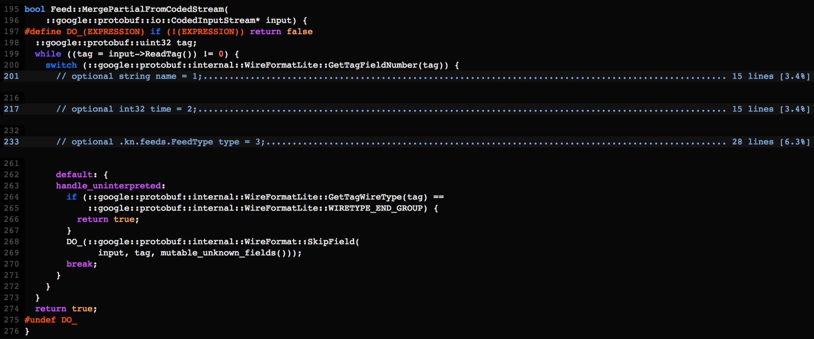
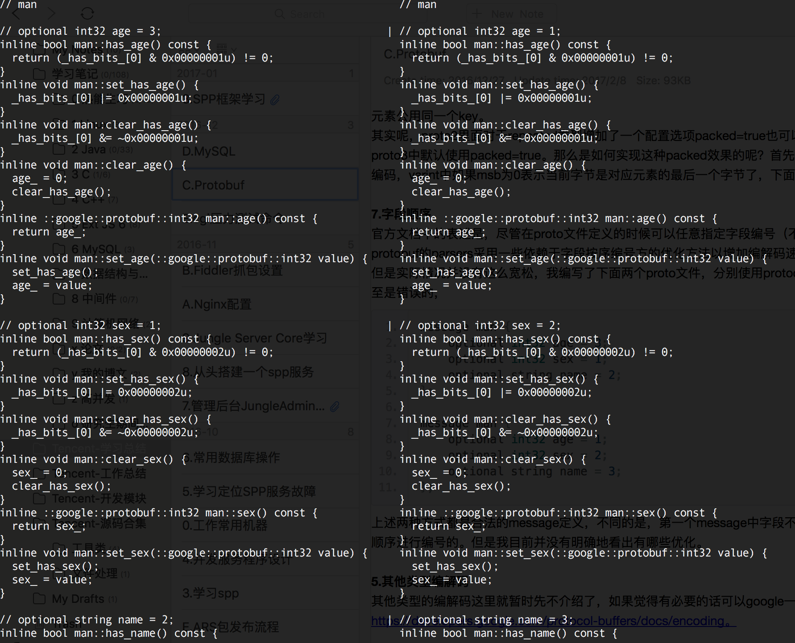
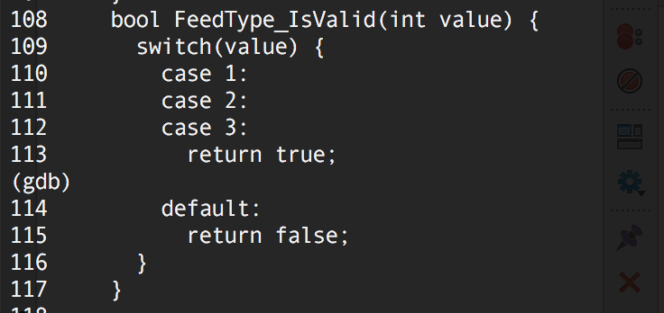
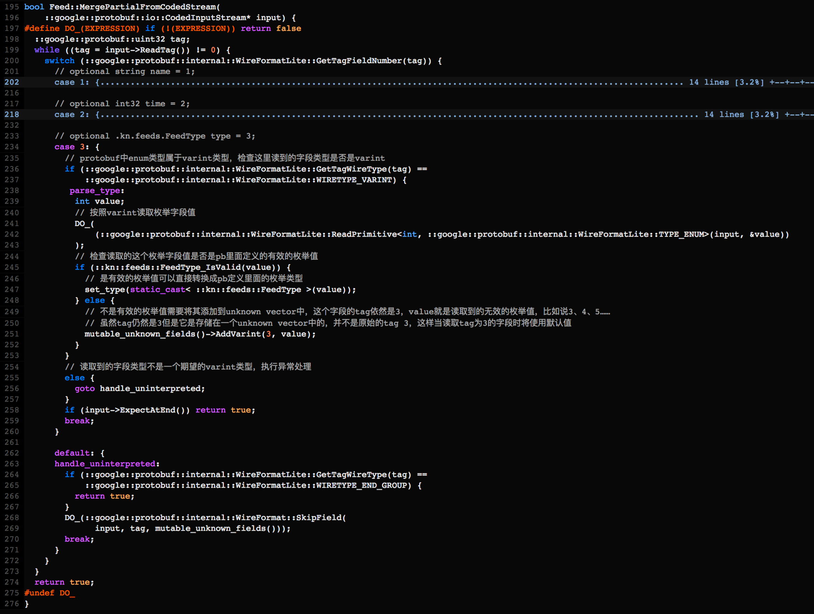

<style>
img {
    width: 680px;
    padding-bottom: 1rem;
}
</style>
<style>
  img {

  }
</style>

开发过程中学习学习的一点protobuf编解码的知识，以及对遇到的一些编解码相关问题的总结。

# 1.pb数据类型

protobuf对message进行编码时，是将message中的各个成员按照key、value组合成一个字节流，这里的key并不是属性的名字，而是varint(tag<<3 | datatype)，其低3位表示字段类型，类型描述见下图。


当protobuf对一个字节流进行解码的时候，对于那些它不认识的字段会直接跳过，对字节流反串行化操作的代码主要是依赖于各个Message子类的`MergePartialFromCodedStream`方法实现，常用的`ParseFromString`或者`ParseFromArray`方法最终都是调用该方法来完成反串行化任务。`MergePartialFromCodedStream`方法中包括了对unknown tag的处理，这部分代码都是protoc自动插入的，所以每个Message子类的对未知tag的处理方式也是一样的，下面通过一个简单的proto文件进行说明。

文件名：T.proto

```protobuf
package kn.feeds;

enum FeedType {
   TYPE_RECORD_LIVE = 1;
   TYPE_RECORD_VIDEO = 2;
   //TYPE_RECORD_DAYMOMENT = 3;
};
message Feed {
   optional string name = 1;
   optional int32 time = 2;
   optional FeedType type = 3;
};
```

使用`protobuf --cpp_out=. T.proto`进行处理，生成的T.pb.cc中`kn::feeds::Feed::MergePartialFromCodedStream`方法的源码如下图所示，其中对不相关代码进行了折叠。`switch(....GetFieldNumber(tag))`获取到了tag的编号并进行分别处理，如果是一个unknown tag则进入default处理分支，一般情况下是执行DO_(...)将这个unknown tag保存到一个unknown_fields vector中。

文件名：T.pb.cc，见下图：



如果新需求中要求改造旧有的pb协议，例如在message中新追加了一些字段，旧代码在进行反串行化的时候并不会读取到新追加的字段，协议改造对旧有服务是不会产生不良影响的。

另外，大家一般习惯于使用optional对字段进行修饰，这里就optional字段值是否设置对数据传输的影响也进行一下说明：

-   对于message中定义的optional类型的字段field，A给B发消息时，如果A没有显示设置field的值，那么B收到的字节流里面不会包括field字段的信息，B会自动使用proto文件中定义的该字段的默认值。
-   而当A显示设置字段field的值与默认值相同时，传输给B的字节流里面会包括field字段的信息。设置和不设置optional字段对于串行化数据的编码、传输是不同的。

>   PS：对于pb2而言，上述描述是正确的。对于pb3的情况，对编码及网络传输数据量又进行了优化，所有的0值都不会在编码时进行编码。如果系统中涉及到pb2、pb3共用，且存在使用pb2的代码中通过判断字段值是否为nil来做特殊逻辑，这里就容易引入问题。而如果全部是pb3协议则不需要考虑这种兼容问题。

# 2.varint & zigzag编解码

前面列出了protobuf数据类型编码规则，当tag低3位为0时表示varint类型，对于有符号类型、无符号类型其实差别还是挺大的。

-   对于无符号整数类型我们使用varint编码，如果给一个无符号类型赋一个负值，那么最终得到的值为一个很大的无符号数值；
-   对于有符号整数类型我们使用zigzag编码。怎么说呢，感觉zigzag也属于varint编码，但是比较特殊而已，仅用来对有符号整数进行编码。

## 无符号整数varint编解码规则

\- 每个字节的最高有效位（msb）表示是否还有其他字节；

\- 将各个字节从原来的顺序逆序排列一遍；

\- 丢掉各个字节的msb，并将其连接起来；

\- 按照二进制格式解码数据；

这里其实描述的更像是如何理解一个varint编码，属于解码，但是这样看了之后也会很容易理解varint编码过程是如何进行的。

## 有符号整数zigzag编解码规则

0被编码为0，-1被编码为1，1被编码为2，-2被编码为3，2被编码为4……以此类推。

**优点：**

这两种编码方式的优点是编解码规则简单，容易实现；占用字节数量少，减少网络传输代价（绝对值小的数字使用更少的字节进行编码，绝对值大的数字可以使用适当多的编码，而并不是限定为定长的16、32、64位）。

# 3.non-varint编解码

tag低3位为1时表示是使用固定的64位来编码一个数字，这里的数字类型仅限于double和fixed64、sfixed64。

# 4.string编解码

string在编码的时候首先是一个varint编码的长度值（字节数量），然后后面跟着的是字符串对应的各个字节。

下图是一个编码字符串的示例，“testing”被编码成了如下字节流。


# 5.嵌入式类型编解码

与字符串编解码方式是一致的，一个对象A被嵌到对象B中，也是先写一个varint表示A串行化后的字节流长度，然后再写字节流。

# 6.optional & repeated类型编解码

对于repeated元素类型，proto2里面是多key存储的，即列表中每一个元素都是使用的相同的key；在proto3里面与此不同，列表中所有的元素共用同一个key。

其实呢，proto2里面对于repeated类型增加了一个配置选项packed=true也可以达到proto3中的编码效果，proto2中packed属性默认为false；proto3中默认使用packed=true。那么是如何实现这种packed效果的呢？首先写入list中所有元素的直接数量，然后呢逐一对每个元素进行编码，varint中如果msb为0表示当前字节是对应元素的最后一个字节了，下面的字节属于下一个元素。

# 7.字段顺序

官方文档中的表述是，尽管在proto文件定义的时候可以任意指定字段编号（不能重复编号），但还是建议按顺序对字段编号，这有利于protobuf的parsers采用一些依赖于字段按序编号时的优化方法以增加编解码速度。

我编写了下面两个proto文件，分别使用protoc进行处理得到输出的头文件、源文件。第一种定义方式不按字段出现顺序进行编号，这么做并非不可，但是这种方式容易引发错误，非常不利于后期的扩展，因为不按顺序对字段编号，当字段数量比较多并且希望增加一个新的字段时可能都不知道该用哪个数字来对其编号了。

```protobuf
message man {    
   optional int32 age = 3;          // 字段不按顺序编号    
   optional int32 sex = 1;    
   optional string name = 2;
};

message man {                        // 字段按顺序编号  
   optional int32 age = 1;    
   optional int32 sex = 2;    
   optional string name = 3;
};
```

protoc分别对其进行处理后得到的**“头文件”**对比如下，左侧的是“字段不按顺序编号”的，右侧的是“字段”按顺序编号的：



从上述生成的代码来看，字段值是否已经设置`has_${field}`方法以及设置有值`set_has_${field}`的方法，都是使用字段在message中出现的顺序编号对位图进行位与运算的，而不是按照我们手动指定的tag编号去进行位操作的。

>   PS: 当时测试的时候应该是protoc v2.5.0，现在protoc已经到了v3.19.1，对比生成的代码发现，这里hasbits的设置与之前又不同了，即不是声明顺序，也不是tag编号，可能是采用了新的规则？这里不确定，简单搜索了下这里hasbits的设置也有些优化手段，可能是因为采用这些优化手段引起的。
>
>   TODO 以后再补充hasbits设置相关的内容。

之后又对比了一下生成的**“源文件”**的差异，发现在串行化message信息时使用的字段对应的key还是按照我们指定的tag数值去设置的，如下图所示，左侧是不按序编号情况下对字段age=3进行设置的情况，通过字符串`“age\030\003”`我们知道age对应的key是3；右侧是按序编号情况下对字段age=1进行设置的情况，通过字符串`“age\030\001”`我们知道age对应的key是1（key值对应着pb中指定的field tag编号）。


当然了反串行化的时候肯定也是按照这样的原则去做的，这样就能保证通信双方的数据视角是完全一致的，至于前面hasbits的逻辑都是通信一方自己的事情，protoc内置实现如何调整对通信双方没有影响，影响的只是自己根据访问对应字段的效率问题。

总结：尽量按照字段在message中出现顺序进行编号，容易维护、扩展，别没事自讨苦吃，如果字段数量多了又不按序编号，那么新增一个字段的时候都不知道该用哪个编号了。

# x.其他方面

protobuf的其他内容这里就暂时先不介绍了，有描述不清或者错误的地方还请指正。protobuf这种自描述性超强的消息格式获得了广泛的运用，也被诸多RPC框架用作IDL来指导代码生成，其在编解码效率、数据量方面都有不错的benchmark数据，是当今非常流行的消息格式。

protobuf当然也不是唯一一种流行的消息格式，在某些对资源更敏感的游戏场景，flatbuffers也是一种被非常青睐的消息交换格式。还有thrift、xml、json等等诸多格式，它们都有各自的一些适用场景，并非取代与被取代的关系，而是被问题场景选择与被选择的关系。感兴趣的可以更深入了解下。

# y.问题案例

最后总结两个初入职场不久遇到的pb问题，这两个问题是我工作中真实遇到的，这里一并记录下，也对其中与pb相关的其他知识点进行一下总结。

## 问题1

**客户端希望协议中新增一种短视频类型，服务端需要读取出短视频类型并进行存储，但是服务端未能成功接收到客户端提交的新的短视频类型。**

**问题背景：**

客户端、后台定义好了协议，客户端要求提交一种新的短视频类型“日迹短视频”类型，于是后台在FeedType这个枚举类型里面增加了第3个字段DAY_MOMENT，然后呢，客户端重新编译该pb、后台重新编译该pb、各自开发，后来联调一切正常……

过了一段时间呢？另一个后台开发同学不知道proto已经被更新了，他只更新了检出的feeds写服务的代码，并没有更新检出的公共目录feeds/proto下的proto文件，自然也就没有将新的日迹短视频类型这个枚举字段编译到代码中去，就这样发布出去了……

后面客户端同学发现，明明提交的是日迹短视频类型（type=3），后台查询返回的却是普通的短视频类型（type=1），非常不解，检查后台feeds写代码后发现完全是将客户端提交的type直接写到tmem、db的，并没有做任何改动……

造成这个问题的原因已经是很明白了，就是proto文件没有更新，新增加的枚举字段没有编译进去，但是代码在执行的时候到底发生了什么呢？带着这个问题我扒了一下代码终于理清了这背后的原因。

首先其他的后台开发人员没有更新检出的proto文件，导致其个人目录下编译出的代码中缺少“日迹短视频字段”，当客户端提交短视频类型FeedType type=3的时候，3被编码为varint(3)；服务端枚举类型只有两个可枚举值1、2没有3，那么服务端收到请求后通过Feed feed; feed.ParseFromString或者feed.ParseFromArray方法反串行化后，读取出来的值feed.type()是多少呢？这里也不卖关子了，feed.type()返回的是1而不是3。下面就说一下为什么这里返回的竟然是1。

以图1中的T.proto为例，其生成的T.pb.h中包含了如下对FeedType枚举值的检查，当我们执行set_type()方法或者MergeParitalFromCodedStream或者DebugString()的时候，是会对枚举值的有效性进行检查的，检查枚举值有效性的方法就是下图中的FeedType_IsValid()方法。该方法是在enum FeedType中的TYPE_RECORD_DAYMOMENT未被注释掉的情况下生成的，所以switch里面认为case 1、2、3都是有效的；当注释掉TYPE_RECORD_DAYMOMENT生成的switch中就只有case 1、2。无效的枚举值该函数返回false，所以除了case里面出现过的枚举值，其他的都是错误的。

枚举值有效性检查：



这里的方法FeedType_IsValid()会在某些断言assert()中被调用，如果程序中没有定义宏NDEBUG，那么一旦调用了该方法的assert()被执行将直接导致程序退出。但是在现网中肯定是不允许程序就因为收到了一个非法的枚举值就“挂掉”的，那么protobuf中对这种非法的枚举值必然会提供一种处理方法，这个方法是什么呢？

当收到一个pb串行化数据之后，我们希望对其反串行化得到一个自定义的Message对象实例，通常的反串行化方法是调用Message对象实例的ParseFromString或者ParseFromArray方法来完成，这两个方法都调用了一个非常关键的方法：MergePartialFromCodedStream，该方法是基类Message的方法，但是会被Message子类中的方法覆盖，因为如何反串行化数据肯定是由子类中包括的成员来决定的，每个子类都应该提供对应的反串行化实现，这部分代码是protoc自动插入的。以图1中的message Feed为例，protoc处理后生成的T.pb.cc中的MergePartialFromCodedStream方法如下图所示。

*MergePartialFromCodedStream*:



上图是release版本中read tag时读取到tag=3枚举类型FeedType type字段时的相关代码，因为枚举类型也是varint类型，所以会首先检查读取到的tag是否是一个varint类型，如果不是则将其加入unknown_fields vector；如果是则继续检查字段值是否是一个有效的枚举值，如果是则将其强制类型转换成FeedType，并更新调用者Feed对象的成员type；如果不是一个有效的枚举值则将其添加到unknown_fields这个vector中，这个时候调用者Feed对象的成员type并没有被更新，依然是使用的旧值，那么这里的旧值是什么呢？

**在c、c++中枚举类型变量的默认值为0，但是在protobuf中，一个枚举类型变量的默认值为枚举值中的第一个**，我们这里的FeedType type枚举变量可枚举的第一个值为1，所以最终FeedType type的值在Feed feed; feed.ParseFromArray(...rec_pb_data...)之后不是3而是1。

……

上述就是ilive_feeds_write_svr在收到短视频类型为3时写入tmem短视频类型却为1这个问题的原因！

这里只是加深了对protobuf处理过程的理解，并非造成问题的根源，根源应该从代码管理方面找。

>   PS：pb中对枚举值的使用建议，强烈将对应的0值定义为Invalid/Unknown，正常取值从1开始取，用0值表示无意义的枚举值，以解决pb枚举潜在的各种“坑”，这个很重要，我做项目的经历已经清晰地表明了它可能给您的项目带来的风险。

## 问题2

**问题二：直播场景，用户在房间内发送聊天信息，请求中包含了一个房间id字段roomid，表示用户在哪个房间中发言，但是服务端接收到客户端提交的roomid是错误的。**

**问题描述：**

客户端、后台定义好了proto文件，如下所示：

```protobuf
message XXXReq {
   optional uint32 anyfield = 1;
   optional uint32 roomid = 2;
};
message XXXRsp {
   optional uint32 roomid = 1;
   optional ustring json = 2;
};
rpc XXX(XXXReq) return (XXXRsp);
```

但是呢，后来由于协议变动发现XXXReq中的字段anyfield没有用，就删掉吧，于是后台就改成了：

```protobuf
message XXXReq {
   optional uint32 roomid = 1;
};
```

但是呢，客户端那边只是删掉了第一个字段，改成了：

```protobuf
message XXXReq {
   optional uint32 roomid = 2;
};
```

后台并不知道客户端是这么改的……一段时间之后，后台同学发现客户端同学提交过来的参数roomid似乎是有问题的，什么问题呢？同一个用户进入now主播房间后发言，每次发言请求提交的roomid都应该是主播自己的roomid，应该是固定的，但是后台同学发现打印出来的请求中的roomid却是变化的，这是什么问题？

其实这里经过问题1的分析之后也很容易理解了，后台根本就没有读取到客户端设置的tag=2的roomid，后台只是使用了XXXReq req中的默认的roomid值，这个变量又没有进行初始化，roomid中的值是随机值，肯定是会变化的、是错误的。

