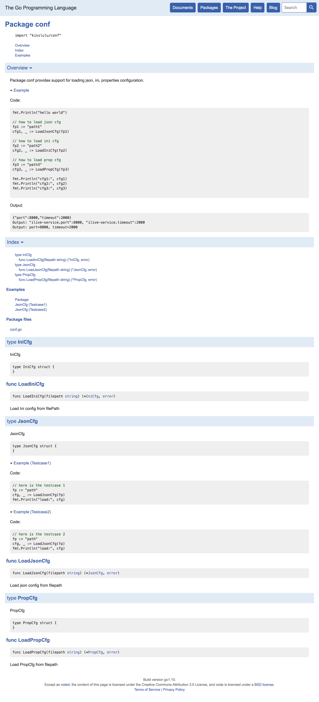

# godoc文档

## 标准库文档
当要查看go标准库文档时，可借助godoc命令进行查询，如```godoc container/list```，也可以在本地开启一个web服务来查询，如```godoc -http=:6060```。

## 非标注库文档
当要查看非标准库（如自建项目）的文档时，我们也是借助godoc来查看，但是执行godoc命令之前需要做些准备工作。

### 希望在文档中看到什么信息

- package介绍
- type介绍
- func介绍
- 示例代码
- 针对package的示例代码
- 针对type的示例代码

上述几种希望看到的信息，我们首先需要在代码中按照godoc约定的方式提供上述信息，godoc才能找到这些信息展示出来。下面就分别描述下如何在代码中包含上述信息。

### package & type & func 介绍

这里对package、type、func的介绍是以leading comments的方式在代码中直接提供的，就是package声明、type声明、func声明前面紧邻的注释，该注释与声明之间没有空行分隔。

以如下文件$GOPATH/src/kisslulu/conf/conf.go为例：

```golang
// Package conf provides support for loading json, ini, properties configuration.
package conf

// JsonCfg
type JsonCfg struct {
}

// IniCfg
type IniCfg struct {
}

// PropCfg
type PropCfg struct {
}

// Load json config from filepath
func LoadJsonCfg(filepath string) (*JsonCfg, error) {
}

// Load Ini config from filePath
func LoadIniCfg(filepath string) (*IniCfg, error) {
}

// Load PropCfg from filepath
func LoadPropCfg(filepath string) (*PropCfg, error) {
}
```

运行```godoc -http=:6060```找到对应的package kisslulu/conf即可预览文档中对package、type、func的介绍。

### package & type 示例代码
godoc中的示例代码是存放在一个独立的文件“**example_test.go**”中的，这个文件名是固定的。以上文中这个conf package为例，为其编写相应的package示例代码和type示例代码。

#### example_test.go
这个示例代码文件的包名定义为```package conf_test```或者```package conf```都可以，其他包的话```go install```会提示```error: can't load package...```，godoc运行时会对example_test.go中的示例代码进行加载并渲染。

#### package示例代码
package示例代码是编写在在```func example() {...}```函数里面，只能包含一个package示例代码，通常在package示例代码里面详细描述该package的使用方法，比如完整package conf解析json、ini、prop配置文件的方法。

以下是一个示例：

```golang
package conf_test

import "fmt"

func example() {
fmt.Println("hello world")

// how to load json cfg
fp1 := "path1"
cfg1, _ := LoadJsonCfg(fp1)

// how to load ini cfg
fp2 := "path2"
cfg2,_ := LoadIniCfg(fp2)

// how to load prop cfg
fp3 := "path3"
cfg3,_ := LoadPropCfg(fp3)

fmt.Println("cfg1:", cfg1)
fmt.Println("cfg2:", cfg2)
fmt.Println("cfg3:", cfg3)

// Output: {"port":8000,"timeout":2000}
// Output: "ilive-service.port":8000, "ilive-service.timeout":2000
// Output: port=8000, timeout=2000
}
```

#### type示例代码

每中类型下往往定义了多个方法，可能有需要对多个方法提供示例代码，所以可以godoc约定允许通过函数“**func Example${type}_${testcase} {...}**”提供多个示例代码，需要注意的是${testcase}必须首字母小写，否则godoc会忽略。

以```type JsonCfg```为例：

```golang
package conf_test

import "fmt"

func example() {
// ...
}

func ExampleJsonCfg_testcase1 () {
// here is the testcase 1
}

func ExampleJsonCfg_testcase2 () {
// here is the testcase 2
}
```

### 看下文档效果
运行```godoc -http=:6060```，然后浏览器中打开```localhost:6060```，定位到```package kisslulu/conf```即可查看文档效果，如下图所示。
