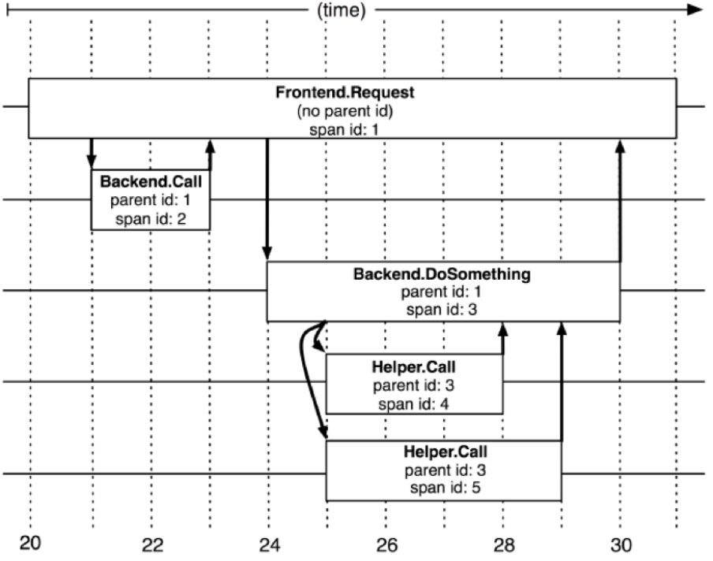
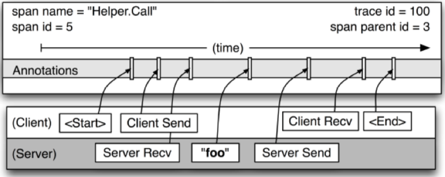
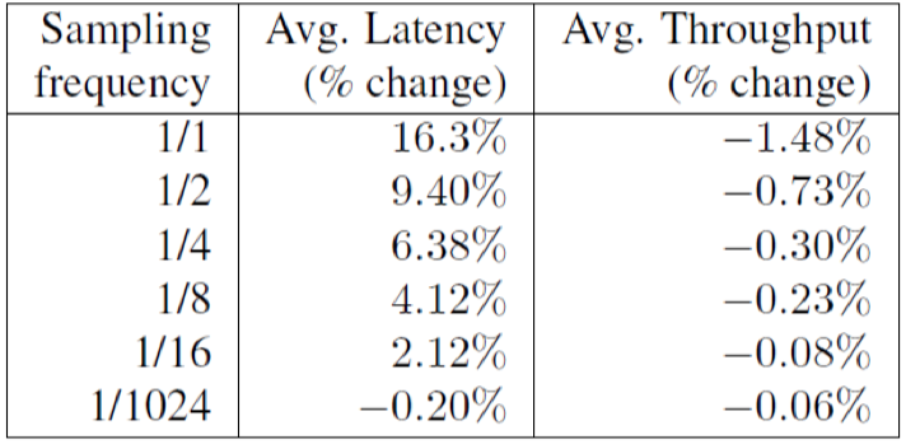
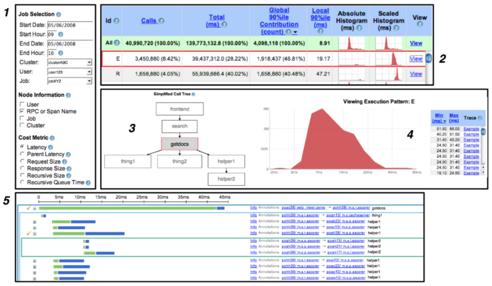

dapper，大规模分布式跟踪系统，现在有不少开源实现是基于dapper的核心思想来设计的，如zipkin、jaeger、lightstep、appdash等。了解dapper的工作原理，也方便理解zipkin、jaeger这几个常用的分布式跟踪实现，使用opentracing来集成不同的backend的时候也不至于一头雾水。所以又把dapper的论文阅读了几遍，梳理了下其核心思想。网上也有不少这篇论文的中文译文，但是翻译的蹩脚，理解起来很晦涩，所以还是自己梳理下方便以后查阅，也希望对大家有帮助。

[TOC]

# 分布式跟踪

分布式跟踪系统，能够将系统中各个服务之间的调用关系（依赖关系）、请求耗时情况、请求方式（串行、并发）等等清晰地展示出来，对于快速定位系统调用链路中出现的异常问题有着非常重要的作用。不管是普通程序开发人员，还是web、rpc或其他框架开发人员，都希望能集成分布式跟踪的能力。

# dapper简介

现在主流的分布式跟踪系统，基本都是基于google发布的论文dapper来进行后续开发的，论文中详细解释了dapper实现分布式跟踪的原理，点击查看 [dapper：大规模分布式跟踪系统](https://bigbully.github.io/Dapper-translation/)。

## 设计初衷

分布式跟踪系统，其职责就是“**无所不在的部署，持续的监控**”，这也是真正提现分布式跟踪能力的前提。“**无所不在的部署**”，这非常重要，因为即使一小部分监控没有监控到，也会让人对整个跟踪结果产生质疑。“**持续的监控**”，监控应该是7x24小时不间断的，对于某些小概率事件或者难以重现的事件，如果不能做到持续监控就有可能遗漏这部分异常。

## 设计目标

dapper将“**无所不在的部署，持续的监控**”作为大的方向，由此也确定了具体的3个设计目标。
- **低开销，跟踪系统对在线服务的影响应该足够小**
有些服务是经过开发人员高度优化后的，如果跟踪系统引入的overhead比较大，就可能抵消掉之前优化工作带来的性能提升，开发人员不得不关停分布式跟踪能力。
- **应用透明，分布式跟踪的实现细节应该对应用开发人员透明**
应用开发人员是不需要知道有分布式跟踪这回事的，如果一个跟踪系统不能屏蔽这些细节、需要开发者配合的话，这种业务侵入性很强的跟踪系统是难以大力推广的，也就难以实现“无所不在的部署”这样的能力，也就不能实现全面细致的跟踪。
- **可伸缩性，面对未来N年服务集群扩大的趋势，都应该能对其进行有力地把控**
分布式跟踪系统不只是跟踪几个、十几个服务，它在设计上要能够对大规模的服务集群进行全局把控。这就要求其必须保持足够的可伸缩性，在服务集群扩大之后要通过某种形式的“扩容”来保证分布式跟踪能力的线性增长。这里的扩容可能是机器级别的、网络级别的、存储级别的。

这3个设计目标之外，还有另一个设计目标，“**信息处理的速度要足够快**”。如果信息处理的速度足够快，就可以近乎实时地发现线上系统中存在的异常问题。

## 实现方案

dapper在许多高阶的设计思想上吸取了`pinpoint`和`Magpie`的研究成果，但在分布式跟踪领域中，dapper的实现包含了许多新的贡献。例如为了保证对业务服务的“低开销”，引入了“**采样率**”。dapper的另一个特征就是在足够低的层级实现分布式跟踪，以对应用级透明。

### 跟踪树

dapper的分布式跟踪方案可以借助下图来一探究竟，其核心思想是从客户端（user）发起的请求一直到接入层服务A，再到后端服务B、C，再从C到D、E，整个请求处理链路可以借由一个树形结构来表示出来。可以通过将服务器上发生的每一次请求、响应作为一个记录收集起来，收集信息包括跟踪标识符（message identifier）和时间戳（timestamped events）。通过添加标注（annotation），依赖于应用程序或中间件明确地标记一个全局id，从而连接每一条收集的记录和用户发起的请求。显然这里需要代码植入，不过我们可以代码植入的范围收敛到框架层，保证对应用层透明。

下面对dapper的设计思想进行更深入的了解，我们将先从上图中涉及到的几个关键概念开始。

### 跟踪（trace）

**在dapper跟踪树结构中，树节点是整个架构的基本单元，而每一个节点是一个span，它又包含了对其他span的引用**。节点之间的连线表示的是当前span与它的父span或者派生出的子span之间的关系。span在日志文件中的表示只是简单的记录请求开始时间、请求结束时间，span在整个树形结构中它们是相对独立的。

)

上图是一个分布式跟踪过程的示意图，图中说明了span在一个完整的跟踪过程中是什么样的，dapper记录了span的名称、span-id、父span-id，以重建一次跟踪过程中不同span之间的关系。如果一个span没有父span-id那么它是root span，也就是整个调用链的起始点。所有span都挂在一个特定的跟踪链上，也共用同一个跟踪id，即trace-id（图中未标出）。所有这些id（trace-id、span-id）都是全局唯一的64位整数表示。

在一个典型的dapper跟踪中，我们希望为每一个rpc对应到一个单一的span上，而且每一个额外的组件层都对应到一个跟踪树型结构的层级。

### 跨度（span）

下图中给出了一个更加详细的dapper跟踪中span记录点的视图，其实**每个span记录点都包含了两个不同的视角（client端RPC视角，server端RPC视角）**，图中也画出了rpc Helper.Call的client、server端视角，如client发送请求、server接收请求、server处理、server发送响应、client接收响应的过程。span的开始、结束时间，以及任何rpc的时间信息都可以通过dapper在rpc组件库中植入代码以记录下来。

如果应用程序开发者希望在跟踪中增加自己的注释信息（业务数据），如图中的“foo”，这些信息也会和其他span一样记录下来。

此外，**任何一个span记录点都包括了来自rpc client、rpc server端的主机信息**。每一个span记录点可以包含来自client、server两端的注释信息，使得span记录点能够记录请求方、响应方这两个主机的信息。**另外由于记录的时间戳来自不同的主机，不同的主机上的时间可能存在一定的时间偏差（时钟漂移），必须考虑时间偏差带来的影响，因为它会影响到我们判断某个span的发生时间的先后顺序**。我们可以基于这样的一个事实，就是rpc client发送一个请求之后server才可以收到，对于响应也是一样，server响应之后client才能收到响应，这样一来rpc server端的接收响应时间戳、发送响应时间戳就确定了一个上下限。

### 植入点（instrumentation point）

dapper可以对应用开发者以近乎零侵入的成本对分布式控制路径进行跟踪，几乎完全依赖于少量通用组件库的改造，如在框架层对现有rpc代码进行改造，植入分布式跟踪相关的代码。

如何记录跟踪上下文信息呢（trace-id、parent span-id、span-id）？不同的rpc框架可能基于不同的网络服务模型（同步、异步、多进程、多线程、协程）实现，需要考虑清楚如何保存这里的跟踪上下文，可以结合不同的编程语言提供的语言特性来辅助实现，如基于java多线程模型实现的rpc框架可能会考虑通过ThreadLocal来存储跟踪上下文信息，golang可以通过goroutine局部变量来寄存跟踪上下文信息，C++可以通过一个全局map结构来维护请求seq与跟踪上下文的映射关系等，这只是一种保存跟踪上下文信息的思路，具体的场景还需要具体分析。

### 注释（annotation）

下面是通过c++和java向跟踪中span记录点添加注释的方法：

上述植入点可以帮助推导出复杂的分布式系统的跟踪细节，使得dapper可以在不改动应用代码的情境下就可以发挥其核心功能。然而，dapper还允许应用开发人员在跟踪的过程中添加额外的信息，以监控更高级别的系统行为，或帮助调试问题。

dapper允许用户通过一个简单的api来定义时间戳的annotation，核心代码如上图所示，这些annotation可以添加任意内容，为了避免dapper使用者过分热衷于添加注释，dapper也添加了一些限制，即单个span有一个可配置的annotation数量上限。

除了上图中展示的添加的文本annotation，dapper也支持添加key-value形式的annotation，提供给开发人员更强的跟踪能力。

### 采样率（sampling）

低开销是dapper的关键设计目标之一，如果这个工具一开始设计的时候其价值还未被充分认可，而又对性能有明显开销的话，其他开发人员、运维人员是肯定不愿意去应用、推广这个玩意的。况且，dapper希望能够让开发人员通过使用annotation的方式来增强跟踪能力，而又不用担心性能方面的开销。而在开发过程中也发现，某些类型的web服务性能对植入代码确实比较明显。因此dapper开发人员除了把dapper的收集工作进一步优化，使其对应用性能影响尽可能小之外，还引入了进一步控制性能开销的方法，那就是当遇到大量请求时只记录其中一小部分。我们在文章的后续部分会进一步描述采样率方案更多的细节。

### 跟踪的收集

下图展示了dapper的跟踪的收集过程，大致可以分为图中1、2、3三个过程。

1. 应用程序通过dapper api将span数据写入本地日志文件中
2. dapper守护进程和收集组件把这些日志信息从生产环境的日志文件中拉取出来
3. dapper守护进程和收集组件将拉取到的日志信息整理，并写入BigTable仓库中
    - 一次跟踪，被设计成BigTable中的一行
    - 每行中的每一列都代表了一个span
    - 不同跟踪涉及到的span数量可能不同，BigTable支持稀疏表格，很适合这种场景

dapper还提供了额外的api来帮助我们快速访问BigTable仓库中的跟踪数据。

### 安全和隐私

前面提到了应用程序中可以在当前span中添加一定数量的annotation来进一步增强跟踪能力（因为trace分析工具可以在收集到的日志数据中提取出这些信息），这些annotation可以帮助定位系统为何表现异常的原因。然而，有些情况下，这些数据中可能包含了敏感信息，这些信息不应该暴露给未经授权的用户（包括正在debug的工程师）。

安全和隐私问题应予以足够的重视，dapper中可以记录rpc的名称，但是不记录任何有效载荷数据，如请求体、响应体信息。相反，应用程序级别的annotation提供了一个方便的可选机制：应用程序开发人员可以在span中选择关联那些为以后分析提供价值的注释信息。

dapper还提供了一些安全上的便利，这是dapper的设计者所始料未及的。通过跟踪公开的安全协议参数，dapper可以过检相应级别的认证或加密系统，来监视应用程序是否满足安全策略。dapper还可以提供信息来决定是否启用期望的系统隔离策略，例如支撑敏感数据的应用程序不得与未经授权的系统组件进行交互。这样的措施提供了比源码审核更强大的安全保障。

## 部署状况

无处不在的部署，持续监控，应用级透明！dapper在谷歌使用已经有多年，通过了线上环境的检验。

### dapper运行库

在谷歌内部，dapper主要是被植入到了一些通用的基础rpc框架、线程控制和流程控制组件库中，其中包括span的创建、采样率设置，以及把日志写入本地磁盘中。除了做到轻量级，植入的代码更需要稳定和健壮，因为它与海量的应用对接，一旦植入代码有问题，将使得维护和修复bug变得很困难。实际植入的代码是由未超过1000行的c++和不超过800行的java代码组成。为了支持key-value形式的annotation还额外植入了500行左右代码。

### dapper覆盖情况

dapper的推广是从两个维度进行，一个是在生产环境应用中生成dapper traces（这里的应用链接了前面提到的dapper运行库），另一个是收dapper traces colletion daemon来收集生成的这些dapper traces。dapper daemon是我们的机器安装的OS镜像的一部分，因此几乎谷歌内部的所有的线上服务器都支持dapper跟踪。

在某些情况下dapper可能不能够正确地跟踪控制路径，这可能是因为使用了非标准的控制流操作，或者是dapper错误地将跟踪信息归类到不相关的事件上。dapper提供了一个简单的库来帮助开发人员手动控制跟踪的传播信息，也算是一种上述问题的办法吧。当前大约有40多个c++程序和33个java程序需要手动控制跟踪信息传播，只是google线上应用的九牛一毛，足可以忽略不计。还有一部分是因为没有使用dapper运行时库，如使用原生的tcp socket、soap rpc进行通信，这种dapper肯定也是无法跟踪的。

早期部署的时候，dapper还没有那么稳定，所以默认是关闭的， 直到dapper开发人员对其稳定性和开销有了足够的信心之后才将其修改为默认开启。

### 注释使用情况

程序员倾向于将应用层级的一些dapper annotation作为一种分布式调试日志使用，或者用来对dapper traces进行分类。例如，所有的BigTable请求都添加了要访问的表名来作为annotation。当前几乎70%的dapper spans以及90%的dapper traces包括了至少1个dapper annotation信息。

41个java应用、68个c++应用添加了自定义应用层级的annotation来更好地理解span内的活动信息。现在来看java开发人员在span内添加的annotation比c++开发人员要多一些，这可能是因为c++服务更偏底层，java应用更接近用户，逻辑更重一些，其中涉及到的各种服务器请求更多一些。

## 管理跟踪开销

跟踪系统的开销主要有两部分组成，一是被监控系统生成trace数据和trace daemon收集这部分trace数据所带来的系统性能下降，二是需要使用一部分资源来存储和分析trace数据。虽然说我们认为对一个有价值的中间件植入跟踪带来一部分性能开销是值得，但是如果能讲这里的开销降低到可以忽略的程度，那是最好不过了，推广该跟踪系统也会变得更加简单。

从3个方面展示跟踪系统的开销情况：dapper组件操作的开销，跟踪收集的开销，dapper对生产环境负载的影响。这里也会介绍dapper的可变采样率机制如何帮助降低开销，以及如何在低开销和获得代表性的跟踪二者之间获得平衡。

### 生成跟踪的开销

生成trace数据的开销是dapper性能影响中最关键的部分，因为收集、分析trace数据的工作可以在紧急情况下更容易被关闭。**dapper运行库中生成trace数据的开销，主要是创建和销毁span、annotation，并将其记录到磁盘供后续收集而引入的**。root span的创建和销毁平均需要消耗204ns的事件，创建、销毁其他span则只需要大约176ns，这是因为root span的创建需要生成一个全局唯一的id，开销稍大些。

如果一个span没有被采样的话，这个span下创建annotation的成本几乎可以忽略不计，平均只需要9ns。如果被纳入采样的话，会用一个字符串来进行标注，平均需要40ns。这些数据都是在2.2GHz的x86服务器上采集的。

在dapper运行期将trace数据写入到本地磁盘是开销最大的操作，但是他们的可见开销大大减少了，因为写入日志文件的操作相对于被跟踪的应用系统来说是一个异步的操作。不过，如果请求量特别大的情况下，尤其是采样率很高的情况下，日志写入的操作仍然是开销比较大的操作。后面会展示一个web搜索的负载下的的性能开销示例。

### 跟踪收集的开销

读取生成的trace数据也会对负载产生一定的干扰，下表展示了最坏情况下，dapper trace collector daemon在高于实际情况负载情况下进行trace收集过程中cpu使用率情况。在生产环境中，这个守护进程从来没有超过0.3%的单核cpu使用率，而且只有很少量的内存使用（以及堆碎片噪音）。我们还限制了dapper守护进程的调度优先级为最低优先级，以避免在一台高负载的服务器上出现cpu竞争。

dapper也是一个带宽资源的轻量级消费者，每一个span在传输到BigTable仓库过程中平均只占用了426个字节。作为网络行为中的极小部分，dapper的trace数据收集在谷歌的生产环境中只占用了0.01%的网络资源。

### 生产环境的开销

每个用户请求可能会牵扯到对大量的高吞吐量的线上服务的请求调用，这也是为了进行分布式跟踪的原因之一。这种情况下会生成大量的trace数据，并且他们对性能的影响是最敏感的。在下表中我们用集群下的网络搜索作为例子，通过调整采样率来衡量dapper在延迟和吞吐量方面对线上服务性能的影响。

从表中可以看到，采样率的变化对服务吞吐量的影响不是很明显，但是对服务延迟的影响还是比较大的，因此也可以得出这样的结论，对trace数据进行采样还是很有必要的。

当我们把采样率调整到1/16之后，引入的服务延迟和吞吐量的开销就全部在实验误差范围内了。在实践中，我们还发现即便采样率调整到1/1024后仍然有足够量的trace数据来跟踪大量服务。保持dapper的性能开销基准在一个非常低的水平是非常重要的，因为它为哪些应用提供了一个宽松的环境来使用完整的annotation api来增强跟踪能力的同时而无需担心性能损失。使用较低的采样率也是有额外的好处的，可以让持久化到硬盘中的trace数据在垃圾回收机制处理之前保留更长的事件，这样为dapper的收集组件保留了更多的灵活性。

### 可变采样

进程中dapper所引入的开销与采样率成正比。dapper的第一个生产版本统一将采样率设置为了1/1024。这个简单的方案对高吞吐量的线上服务是很有用的，因为那些感兴趣的事件在吞吐量大了之后通常可能会经常出现，容易被再次捕捉到。

但是，这种较低的采样率，对于吞吐量比较小的线上服务可能就不太明智了，会很容易错过一些事件，这个时候可能希望配置成较高的采样率，如1，但是又可能要担心引入的性能开销。关键的是，这种情况下要覆盖默认的采样率1/1024还需要人工进行干预，这可不是dapper设计者所期望的，这样就引入了可变采样。

**在部署可变采样(也称自适应采样)的过程中，参数化配置采样率时，不再使用一个统一的采样方案，而是使用一个采样期望率来标识单位时间内采样的trace数量**。例如希望1min内采样100条记录，在高吞吐量的线上服务中就多丢弃一些trace数据，在低吞吐量的线上服务中就少丢弃一些trace数据。这样一来，高吞吐量的将自动降低采样率，低吞吐量的将自动提高采样率，从而使得开销一直低于开销基准以下。实际使用的采样率会随着跟踪本身记录下来，有利于trace分析工具进行准确的分析。

### 应对积极采样

在高吞吐量的线上服务中往往采样率会低至0.01%，新的dapper用户往往会觉得这不利于他们的分析。但我们在谷歌的实践经验使我们相信，对于高吞吐量服务，如果一个显著的操作在系统出发生了一次，那它就会出现成千上万次，因此积极采样（agreessive sampling）（指的应该是可变采样动态调整采样率）并不会妨碍他们的分析。低吞吐量的服务，也许每秒就几十次请求，而不是几十万，即便采样率为100%也可以负担的起每一个请求。综合这两种情况，积极采样（可变采样而非固定采样率不变）没什么问题，这是促使我们决心使用可变采样的原因。

### 额外采样

上述采样策略描述的是应用程序生成trace数据时是否记录到本地磁盘中，通过可变采样减少性能开销的同时不丢失过多的跟踪事件以保证跟踪能力。dapper的团队还需要将收集到的trace数据写入中央资料库的BigTable仓库中，需要控制写入规模，因此为了达到这个目的，还需要结合“**二级采样**”。

目前我们的生产集群每天产生超过1TB的trace数据，dapper的用户希望生产环境下的进程的跟踪数据从被记录之后能够保存至少两周的事件。逐渐增长的trace数据密度必须和dapper中央仓库锁消耗的服务器及硬盘存储进行权衡。高采样率还使得dapper收集器写入BigTable中央仓库的速率接近了BigTable写吞吐量上限。

为了维持所需的硬件成本和渐增的BigTable写吞吐量之间的灵活性，我们**在trace数据收集系统自身中增加了额外的采样控制**。这里充分利用了所有span都来自一个特定的trace并共享同一个trace-id这个事实，有些span可能横跨了数千个主机。对于收集系统中的每一个span，我们用hash算法把trace-id转成一个标量z，这里0<=z<=1。如果z比我们收集系统中指定的系数（阈值）低的话，我们就保留这个span信息，并写入到BigTable仓库中；反之，我们就丢弃它。trace-id唯一标识了一个trace，我们要么保存整个跟踪信息，要么全部丢弃，而不是单独处理trace数据内的某个span。

有了这个额外的“**全局写入率参数**”之后，使我们的收集管道变得简单多了，因为我们可以很容易地在配置文件中调整它来控制写入率。

### 总结

dapper结合两种采样策略，来平衡开销、跟踪效果、硬件成本之间的关系：
- 应用程序中生成trace数据并记录到本地磁盘，此过程应用“可变采样策略”；
- trace数据收集系统收集数据写入BigTable中央仓库，此过程应用“额外采样策略”；

## dapper工具

关于dapper的配套工具，这里只给一个dapper操作界面的展示，方便大家了解大致上具备哪些能力，如下图所示。

大家可以了解下zipkin、jaeger，他们都是基于dapper演化而来，这里我们就再详细介绍dapper自身的工具了，因为我们也无法使用它，只能用开源实现zipkin、jaeger之类的。

本文主要是为了阐述dapper的设计思想，方便我们大家了解分布式跟踪系统的工作原理，然后方便我们将现有的开源实现zipkin、jaeger集成到我们自身的框架中，方便自己的业务开发人员定位线上问题。

如果对谷歌dapper的工具感兴趣的话，可以参考这里的说明，点击查看 [dapper：大规模分布式跟踪系统](https://static.googleusercontent.com/media/research.google.com/zh-CN//archive/papers/dapper-2010-1.pdf)。

## dapper使用

dapper在谷歌被广泛使用，一部分直接通过dapper的用户界面，另一部分间接地通过对dapper api的二次开发或者在现有的api基础上建立的应用。

原dapper论文中列举了一些成功的dapper使用场景，大家也可以参考下，决定将dapper，或者zipkin、jaeger用在什么场景下呢？能够通过二次开发定制化一些自己需要的可视化工具出来呢？这个是我们要思考的，也是对我们的应用开发人员、维护人员最优价值的部分。

### 在开发中使用dapper

Google AdWords借助dapper来优化自己的系统，发现系统中延迟过高的服务调用，发现不必要的串行请求并推动团队修复，以改善性能问题等等。

### 与异常监控的集成

Google维护了一个不断从进程中收集异常信息并集中异常信息报告的服务，如果这些异常发生在跟踪采样的过程中，对应的trace-id和span-id也会被记录到异常记录中，后续借助可视化工具可以容易定位异常发生在链路中的哪一个环节，并借助annotation来进一步定位问题。

### 解决延迟的长尾效应

当一个系统不仅涉及数个子系统，而是几十个开发团队的涉及到的系统的情况下，端到端性能较差的根本原因到底在哪，这个问题即使是我们最好的和最有经验的工程师也无法正确回答。在这种情况下，Dapper可以提供急需的数据，而且可以对许多重要的性能问题得出结论。

### 推断服务依赖

线上服务基本都是集群部署，每一个服务上运行的任务可能依赖了其他的很多服务，而不同的任务依赖的服务也是是动态改变的，所以不可能仅从配置信息上推断出所有这些服务之间的依赖关系。dapper核心组件与dapper跟踪annotation一并使用的情况下，“Service Dependencies”项目能够推算出任务各自之间的依赖，以及任务和其他软件组件之间的依赖。在公司内部的各个流程需要准确的服务依赖关系信息，以确定瓶颈所在，以及指导服务的迁移计划。

### 不同服务的网络使用率

谷歌投入了大量的人力和物力优化其网络，以前网络管理员只能关注独立的硬件信息、常用工具及以及搭建出的各种全局网络鸟瞰图的dashboard上的信息。网络管理员确实可以一览整个网络的健康状况，但是，当遇到问题时，他们很少有工具可以及时准确地定位到导致网络负载高的应用程序级别的罪魁祸首。
虽然dapper不是设计用来做链路级的监控的，但我们发现，它非常适合去做集群之间应用级网络活动的分析。谷歌利用dapper这个平台，建立一个不断更新的控制台，来显示集群之间最活跃的应用级网络流量热点。此外，使用dapper我们能够为昂贵的网络请求指出具体到应用级的原因，而不是面对不同服务器之间的信息孤岛无所适从。

### 分层和共享存储系统

在Google的许多存储系统是由多重独立复杂层级的分布式基础设备组成的。例如，Google的App Engine就是搭建在一个可扩展的实体存储系统上的，该实体存储系统在BigTable基础上封装、暴露了某些RDBMS功能。 BigTable呢，又同时使用了Chubby（分布式锁系统）及GFS。
在这种分层的系统中，并不总是很容易确定最终用户资源的消费模式。例如，针对一个给定的BigTable单元格的大量GFS请求主要来自于一个用户或是由多个用户，但是在GFS层面，这两种明显的使用场景是很难界定的。而且，如果缺乏一个像dapper一样的工具的情况下，对共享服务的竞争可能会同样难于调试。
dapper的用户界面可以聚合那些调用任意公共服务的多个客户端的跟踪的性能信息。这就很容易让提供这些服务从多个维度给他们的用户排名，例如，入站的网络负载，出站的网络负载，或服务请求的总时间。这样就便于对一个共享服务确定其上游服务对其造成的负载情况进行界定，便于后续推动上游优化服务调用逻辑或者独立部署共享服务等等吧。

### dapper的救火能力

对于一些“救火”任务，dapper可以处理其中的一部分。对于那些高延迟，不，可能在正常负载下都会响应超时的服务，Dapper用户界面通常会把这些瓶颈的位置隔离出来。通过与dapper收集跟踪的守护进程的直接通信，那些特定的高延迟的跟踪数据轻易的就能收集到。当出现灾难性故障时，通常是没有必要去看统计数据以确定根本原因的，只查看示例跟踪就足够了。
但是，除非收集到的dapper数据的批量分析能在问题出现10分钟之内完成，否则dapper就不能处理这样的“救火”任务。

# 总结

本文中，我们介绍了谷歌dapper分布式跟踪系统，并汇报了谷歌内部的开发、使用经验。 dapper几乎部署在所有的谷歌线上系统上，并可以在不需要应用级修改的情况下进行跟踪，而且没有明显的性能开销。dapper对于开发人员和运维团队带来的好处，可以从大家对跟踪用户界面的广泛使用上看出来，另外我们还列举了一些dapper的使用案例来说明dapper的作用，这些案例有些甚至都没有dapper开发团队参与，而是被应用的开发者设计、开发出来的。

据我们所知，这是第一篇汇报生产环境下分布式系统跟踪框架的论文。事实上，我们的主要贡献源于这个事实：论文中回顾的这个系统已经运行两年之久。我们发现，结合对开发人员提供简单API和对应用系统完全透明来增强跟踪的这个决定，是非常值得的。

我们相信，Dapper比以前的基于Annotation的分布式跟踪达到更高的应用透明度，这一点已经通过只需要少量人工干预的工作量得以证明。虽然一定程度上得益于我们的系统的同质性，但它本身仍然是一个重大的挑战。最重要的是，我们的设计提出了一些实现应用级透明性的充分条件，对此我们希望能够对更错杂环境下的解决方案的开发有所帮助。

最后，通过开放dapper跟踪仓库的代码给内部开发者，促使了更多的基于跟踪仓库的分析工具的产生，而仅仅由dapper团队埋头苦干的是远远不能达到现在这么大规模的，这个决定促使了设计和实施的展开。

参考文献：
1 [Dapper, a Large-Scale Distributed Systems Tracing Infrastructure](https://static.googleusercontent.com/media/research.google.com/zh-CN//archive/papers/dapper-2010-1.pdf)
2 [Dapper，大规模分布式系统的跟踪系统](https://bigbully.github.io/Dapper-translation/)