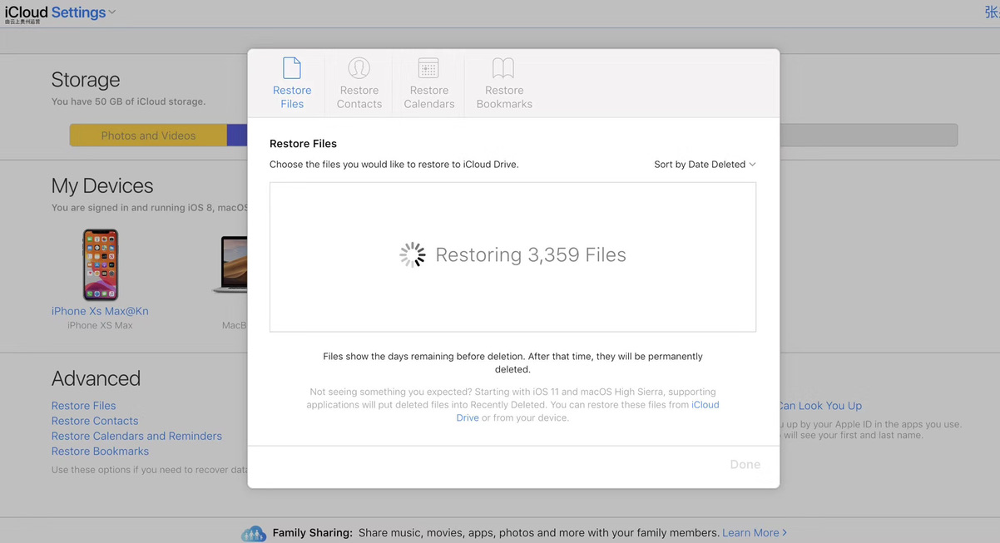

## 背景

大家有没有因为一时大意，错误地执行了`rm -rf`而导致重要文件被删除的情况？一定有那么一次两次的吧。前几天，我又犯了这一次这样的错误。本来是要删除当前目录下的一个文件，于是执行 `rm -rf .`，这里还没有输入完，因为我调整了KeyRepeat设置项的原因吧，按键延迟很短，结果命令变成了 `rm -rf ..`，这个时候`..`已经指向了HOME目录……额，没关注右手，左手还没有tab候选，右手已经键入了回车，gg，眼睁睁地看着大量文件被删除，ctrl+c已经太晚了 :( 。

多亏macOS默认对Desktop、Document等目录下的文件做了自动地备份，不然就真的要苦了，虽然对重要文件、数据也有做过备份，但是也不能做到按月、按天的备份，哪怕是最近几个月的数据、配置的丢失，对我来说也是挺伤的。果不其然，后续几天陆陆续续发现丢失了各种各样的配置，IDE的、bash的、git的、pet的……各种各样的！

不幸中的万幸，一些自己认为真的很重要的数据，一般在Document中交给icloud做了备份，这些数据倒是可以恢复，虽然慢了点，但是能恢复总还是好的！感谢icloud提供的云存储服务！



## 如何避免误删除文件

经此一役之后，我还是思考了一些如何规避的问题，我有多年的Linux使用经验，竟然也会犯这样的错误，我将其归因于：过失问题，虽然像我这样的有经验的开发者极少会犯这样的错误，但是还是会偶尔发生！很多开发者都提出了自己的一些想法，如何规避rm造成的文件误删问题，我们这里不考虑如何恢复的问题，如果是私人笔记本单硬盘单分区的话，恢复的困难度是比较高的。

- 删除只用系统gui删除，如macOS、windows、kde下删除文件到垃圾箱，误删的话还是可以从垃圾箱恢复的；
    
    不适用：执行删除动作是很常见的，作为一名开发者，我不大可能使用gui来频繁切换目录后才删除文件。

- 自定义bash中的alias，如alias rm="function rm() {....}"，该函数内部做一些检查，以决定是否删除文件；
    
    不适用：这也是一个解决问题的思路，但是能否与原生的/bin/rm命令完全兼容是一个问题，而且检查逻辑可能要频繁改动才能胜任各种避免误删的场景，使用起来不是那么灵活。

- 使用第三方的删除工具，如github上的一些类似rm-safe的工具，代替原生的/bin/rm命令；

    不适用：这些工具不能完全与/bin/rm兼容，尤其是那些命令选项不完全兼容，而/bin/rm是一个非常好用的工具，我们只是想尽力规避下误删除的风险而已。

看上去没有一个现有工具能够完全满足自己的选择，那就自己按自己的需要开发一个吧！

## 设计更安全的rm工具

### 分析/bin/rm

首先，不得不说，/bin/rm是一个非常好用的命令，删除文件、删除没目录等等，可以说使用频率非常高，它也确实很好用。说白了，我们只是要在它的基础上做些安全方面的风险规避就能满足需求。

/bin/rm，它有一系列的命令选项，且是POSIX风格的。

- 如果我们开发一个工具，或者在/bin/rm基础上包一层的话，我们最好也使用POSIX风格的命令选项来解析;
- 涉及到rm相关的选项，原来rm有的我们也要有，而且功能必须保持一致；

说白了就是，我们要保证用户使用的时候，习惯保持不变，甚至没有意识到自己在使用一个安全增强的rm。

### 如何安全增强

rm动作是用户自己执行的，除了用户自己清楚目标文件是否重要，没有其他人可以做出胜过文件拥有者的决定，所以安全增强的决定还是交给用户自己来做出，我们的工具只是协助用户完成这样的动作。

设计一个安全增强的rm：
- 支持pin命令，如`rm pin Documents`，保护Documents目录及其下的文件；
    - 当执行`rm -rf Documents`时，发现有.pinLock文件存在，表示Documents目录及其下的文件、子目录受保护，拒绝删除；
    - 当执行`rm -rf Documents/dir/file`时，会递归地回溯目录层级，如果路径上任一父目录受保护，该文件不能被删除；
- 支持unpin命令，如`rm unpin Documents`，取消Documents当前一级目录的保护；
    - 当执行`rm -rf Documents/dir/file`时，如果Documents处于unpin状态，但是dir处于pin状态，file也是受保护的，不能删除；
- 支持`-r`选项，允许递归地添加、移除保护；

### 实现该rm命令

以下是大致的rm命令操作的help信息，它有3个子命令，help显示帮助信息，pin用来对目录添加保护，unpin移除保护。

```bash
$ rm help

hitzhangjie/rm is an security-enhanced version of /bin/rm,
which could avoid the deletion of files by mistake.

rm help:
        display help info

rm pin:
        -r, pin target recursively

rm unpin:
        -r, unpin target recursively
```

当传递给rm的选项，不是rm help/pin/unpin这样的选项时，会将选项当做/bin/rm的选项，进而执行rm相关的动作，所不同的是，这里的删除并不是由/bin/rm来执行，而是由我们重写的一个rmCmd来执行，其内部会首先检查待删除文件、目录是否正在被保护。

该安全增强的rm工具的代码，请戳 [hitzhangjie/rm](https://github.com/hitzhangjie/rm) 查看。

代码量不多，有几个重要的点阐述下：
- 执行rm命令时，给用户必要的提示信息，让用户知道这是一个安全增强版的rm命令，并非shell原生的rm；
- 执行rm pin时，创建文件锁.pinLock，该文件的存在表示其所在的目录及目录下的文件、子目录统统受保护，执行rm时不能删除；
- 执行rm unpin时，删除文件锁.pinLock，改文件备移除之后，表示所属目录及目录下的同级文件、目录不再受保护，但是若子目录中有.pinLock文件仍受保护；
- 执行rm时，因为rm是POSIX风格的命令选项，意味着实现pin、unpin时，最好就别再使用go标准库提供的选项风格进行解析，不然两种风格的选项混在一起，使用起来多有不便；
    这里我们使用的是pflags这一基于POSIX风格的flags解析库。

代码量不多，感兴趣的话，可以自行查看源码，了解具体的实现细节。

如果希望自己也能避免因为手贱带来的文件误删问题，欢迎使用体验该工具！

## 小结

从日常使用角度出发，思考了靠人来避免误删除文件的操作是基本行不通的，还是要提供有效的工具去协助人来对重要文件进行保护。经历过一两次这样的文件误删除操作之后，痛得难受，就醒了，于是自己开发了这个安全增强版本的rm工具，其实寥寥数行代码而已，但是却帮了我大忙。现在偶尔也是会敲出很可怕的命令，但是因为我已经提前对重要文件目录做了保护，再没发生过重要文件被rm误删除的场景了。

我不能保证自己以后不会手贱，但是有这个工具的存在，很大程度上减轻了我的心理压力，哈哈！希望对读者们有帮助! :)

