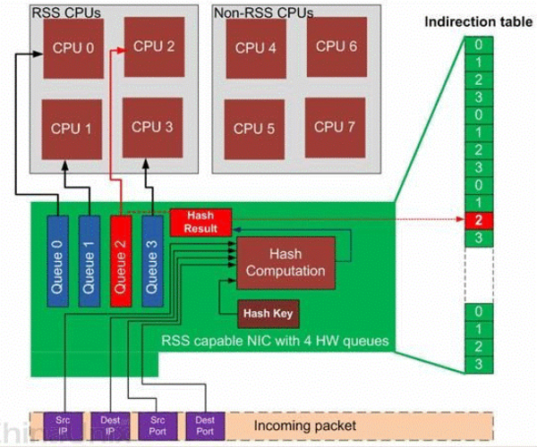
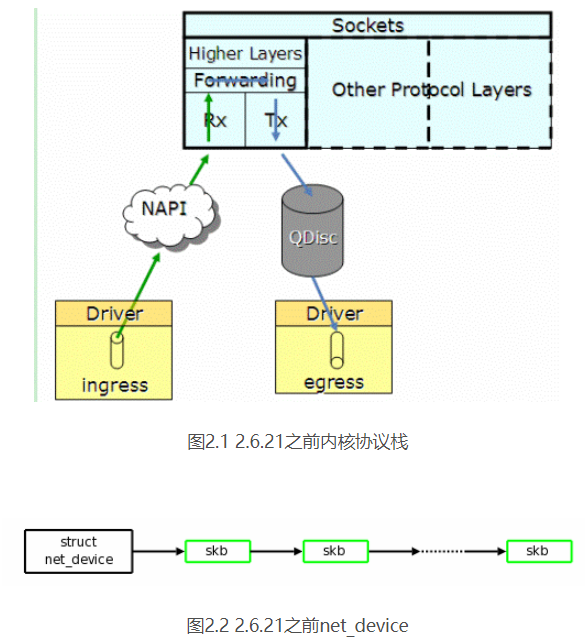

如果网卡NIC支持多队列，可以直接设置NIC多个队列的irq affinity到不同的CPU来实现负载均衡；
如果网卡NIC是单队列的，也可以通过RFS或者RPS在soft interrupt层面进行模拟，来实现负载均衡；
RPS、RFS这种方式主要是针对单队列NIC的优化。

我们是以网卡中断作为示例，对其他不同的设备其实也可以做类似处理。
并不是说所有的设备中断都需要绑定到多个cpu来实现负载均衡，因为有的外设的中断请求数可能并不多，就没必要了。

多队列网卡ethtool -l eth0可以看到combined字段，该字段表明NIC有几个队列，如果有多个队列，比如8个，
那么对应的cpu affinity可以直接设置成ff，表示CPU0-7都可以收NIC中断请求来实现负载均衡。

lspci -vvv可以看到不同的设备对应的中断号，如网卡设别可能是：pin A routed to IRQ 10，我们就知道10是其中断号。

TODO:

- [x] irq affinity设定了情况下，OS和硬件是如何交互的？如何负载均衡的，是在硬件层面实现的？
- [x]  RPS/RFS，这种软中断层面的处理，具体细节是怎样的？

下面以多队列网卡为例来说明怎么回事。

## **多队列网卡实现原理**

#### 1.硬件实现原理

下图是Intel 82575硬件逻辑图，有四个硬件队列。当收到报文时，通过hash包头的SIP、Sport、DIP、Dport四元组，将一条流总是收到相同的队列。同时触发与该队列绑定的中断。 

#### 2.单队列驱动原理

kernel从2.6.21版本之前不支持多队列特性，一个网卡只能申请一个中断号，因此同一个时刻只有一个核在处理网卡收到的包。如图2.1，协议栈通过NAPI轮询收取各个硬件queue中的报文到图2.2的net_device数据结构中，通过QDisc队列将报文发送到网卡。

#### 2.多队列驱动原理

2.6.21开始支持多队列特性，当网卡驱动加载时，通过获取的网卡型号，得到网卡的硬件queue的数量，并结合CPU核的数量，最终通过Sum=Min（网卡queue，CPU core）得出所要激活的网卡queue数量（Sum），并申请Sum个中断号，分配给激活的各个queue。

如图3.1，当某个queue收到报文时，触发相应的中断，收到中断的核，将该任务加入到协议栈负责收包的该核的NET_RX_SOFTIRQ队列中（NET_RX_SOFTIRQ在每个核上都有一个实例），在NET_RX_SOFTIRQ中，调用NAPI的收包接口，将报文收到CPU中如图3.2的有多个netdev_queue的net_device数据结构中。

这样，CPU的各个核可以并发的收包，就不会因为一个核不能满足需求，导致网络IO性能下降。

RSS（Receive Side Scaling，网卡的硬件特性，多队列网卡将不同的流分发到不同的CPU上实现负载均衡）需要硬件支持，在不支持RSS的环境中，RPS/RFS提供了软件的解决方案。

- RPS（Receive Packet Steering）是把一个rx队列的软中断分发到多个CPU核上，从而达到负载均衡的目的。
- RFS（Receive Flow Steering）是RPS的扩展，RPS只依靠hash来控制数据包，提供负载平衡，但是没有考虑到应用程序的位置（指应用程序所在CPU）。RFS目标是通过指派应用线程正在运行的CPU处理中断，增加数据缓存的命中率。

参考内容：

[1]: https://www.alibabacloud.com/blog/597128
[ 2 ]: https://serverfault.com/a/514016

[ 3 ]: https://www.jianshu.com/p/e64d8750ab1c
